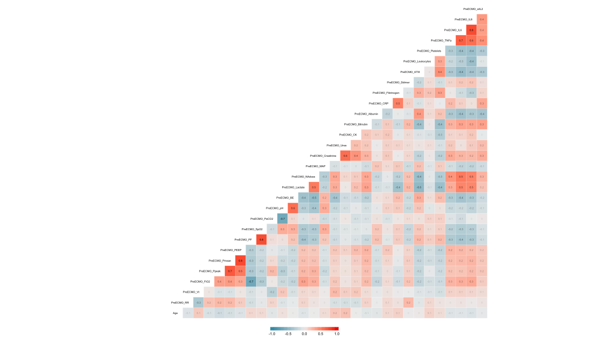

---
title: "Multiple Imputation and Cross-Validation for Classification of Survival Prediction"

thesis: MASTER THESIS
major: Biostatistics
output:
  pdf_document:
    citation_package: natbib
    number_sections: yes
    fig_caption: yes
#    toc: true
    toc_depth: 2
  latex_engine: xelatex
  includes:
    before_body: before_body.tex

tables: true
mainfont: Calibri Light
fontsize: 12pt
geometry: "left=3cm,right=3cm,top=3cm,bottom=3cm"

# bibliography: MasterOfCellTypes.bib
# fontsize: 11
# csl: chicago-author-date.csl
# csl: nature.csl


header-includes: 
  \usepackage[bottom]{footmisc}
  \usepackage{float}
  \floatplacement{figure}{H}
  \usepackage{color}
  \usepackage[table]{xcolor}
  \usepackage{caption}
  \captionsetup[table]{skip=5pt, font=footnotesize}
  \usepackage[font=footnotesize]{caption}
  \usepackage{algorithm2e}
---

```{r setup, include=FALSE, echo = FALSE, eval = TRUE}
knitr::opts_chunk$set(echo = TRUE, eval = TRUE, warning = FALSE, message = FALSE, comment = NA, fig.pos='H', cache=TRUE)
options()
```

```{r libraries, echo = FALSE, eval = TRUE, warning = FALSE, message = FALSE}
source("../project/_settings/libraries.R")
```


\vspace{2cm}
\begin{center}
Robert Edwards 

\vspace{0.125cm}
(2416963E)


\vspace{1cm}
MASTER THESIS 

\vspace{0.125cm}
Biostatistics

\vspace{10cm}
  \includegraphics[height = 1.5cm]{images/GUlogo.png}
\end{center}


\newpage 
\tableofcontents
\listoffigures
\listoftables
\newpage

\newpage
#Introduction

## Aim of the Thesis

+ paragraph about importance of in-sample vs. out-of-sample prediction accuracy
  + Cross validation
  + Over fitting / under fitting 
  
+ Paragraph about Missing data

## The Clinical Study

## Study Population & Data Description

## The Statistical Challenege


\newpage
#Methodology

##Basic Statistical Methods

###Logistic Regression

Logistic regression is a widely used approach in binary classification.  It is set up as a generalised linear model using a logit link that produces a probability. 


###Linear Discriminant Analysis

Linear Discriminant Analysis (LDA) is a widely used method classification method.  generlization of Fisher's Linear Discriminant **(Fisher 1936)**.  Ddiscriminant functions are created through a linear combination of the explanatory variables that characterize the classes.  

$$
\text{Pr}(C_g \ | \ \mathbf{x}) = \frac{\pi_g \text{exp}(-\frac{1}{2} d_g (\mathbf{x}))}{\sum^2_{i=1}\pi_g \text{exp}(-\frac{1}{2} d_i (\mathbf{x}))} ~~~~ g = 1,2
$$

Assumptions of LDA:

+ Explanatory variables are assumed to be normally distributed
+ Homoskedasticity, equal class covariances
+ No multicollinearity
+ Independent observations


Drawbacks of LDA: 

+ Can only utilize continuous explanatory variables
+ Cannot handle missing data


###Quadratic Discriminant Analysis

**(Cover 1965)** 

Quadratic Discriminant Analysis (QDA) is an even more generlized form of discriminant analysis than LDA.  QDA has the same assumptions as LDA with the exception that the covariance of each class is not assumed to be identical.  

Assumptions of QDA:

+ Explanatory variables are assumed to be normally distributed
+ No multicollinearity
+ Independent observations

Drawbacks of QDA: 

+ Can only utilize continuous explanatory variables
+ Cannot handle missing data


###K-Nearest Neighbors

$K$-Nearest Neighbors (KNN) is a commonly used non-parametric classification method.  To predict the class of a new observation, a distance matrix is constructed between all observations and the K nearest labelled observations to the new observation are considered.  The new observation is then assigned the class label that the majority of its neighbors share.  In case of only two classes, ties in class assignments are avoided by using odd values of K.  

In the event of a tie, a class can be chosen at random.  Various distance metrics may be used but it is common to use Euclidean distance to determine the closest training points, though it is advisable to scale variables so that one direction does not dominate the classification. 

As $K$ increases, the variability of the classification tends to decrease at the expense of increased bias. 


###Random Forests


##Validation & Cross-validation


##Accuracy Metrics

These are the default metrics used to evaluate algorithms on binary and multi-class classification datasets in caret.

###Accuracy

Accuracy is the percentage of correctly classifies instances out of all instances. It is more useful on a binary classification than multi-class classification problems because it can be less clear exactly how the accuracy breaks down across those classes (e.g. you need to go deeper with a confusion matrix). Learn more about Accuracy here.

Don’t use accuracy (or error rate) to evaluate your classifier! There are two significant problems with it. Accuracy applies a naive 0.50 threshold to decide between classes, and this is usually wrong when the classes are imbalanced. Second, classification accuracy is based on a simple count of the errors, and you should know more than this. You should know which classes are being confused and where (top end of scores, bottom end, throughout?)

```{r confusion-matrix, echo = FALSE, eval = TRUE, warning = FALSE, message = FALSE, out.width = '100%', fig.align="center", fig.pos="H"}

xtab <- matrix(c("a", "b", "c", "d"), nrow = 2, byrow = TRUE)
colnames(xtab) <- c("Y", "N")
rownames(xtab) <- c("Y", "N")

xtab %>%
  kable(format = "latex", 
        align = c("l", rep("c", 2)), 
        booktabs = TRUE,
        col.names = c("Y", "N"), 
        caption = '\\label{tab:confusion-matrix} Confusion matrix for two classes.') %>%
    kable_styling(font_size = 12, 
                  latex_options = c("hold_position", "striped")) %>%
#  column_spec(1, width = "4em") %>%
  row_spec(0, align = "c")# %>%
#  column_spec(0, bold = T) %>%
#  collapse_rows(columns = 1, valign = "middle") %>%
#  add_header_above(c(" " = 1, "Observed" = 2), bold = TRUE)
```

```{r xtab, echo = FALSE, eval = FALSE}
xtab %>%
  kable(booktabs = TRUE, 
        align = c("|c", "l"),
        format = "latex",
        caption = '\\label{tab:confusion-matrix} Confusion matrix for two classes.') %>%
    kable_styling(font_size = 10, 
                  latex_options = c("hold_position", "striped")) 
```

For the two class confusion matrix in \ref{tab:confusion-matrix} accuracy is defined as:

$$
\text{accuracy} = \frac{a+d}{a+b+c+d}
$$


###ROC

**To mention or not to mention(??)** 

###Cohen's Kappa

Kappa or Cohen’s Kappa is like classification accuracy, except that it is normalized at the baseline of random chance on your dataset. It is a more useful measure to use on problems that have an imbalance in the classes 
On the ARDS datasets, for example, if `ECMO_Survival` is predicted to be "Y" for all cases, then the accuracy is 75% but the prediction is no better than the baseline likelihood of the class percentages.  

Let $p_o$ be the accuracy, the relative observed agreement between observed and predicted classes and let $p_e$ be the probability of chance agreement based on the class probabilities.  Cohen's Kappa is defined as:

$$
\kappa = \frac{p_o - p_e}{1 - p_e}
$$

If all the observations are predicted correctly then $\kappa=1$.  **If the observations are predicted no better than expected by the class probabilities, $p_e$ then $\kappa=0$.  If all the observations are predicted incorrectly, then $\kappa=-1$.**  A positive $\kappa$ indicates that the model predicts better than would be expected by chance whereas a negative $\kappa$ indicates that the model predicts worse than would be expected by chance.  

$$
p_o = \frac{a+d}{a+b+c+d}
$$

For class $k$, number of items $N$ and $n_{ki}$, the number of times $i$ is predicted as class $k$:

$$
p_{o,Y} = \hat{p}_{k1} = \frac{a+d}{a+b+c+d} ~\cdot~ \frac{a+c}{a+b+c+d}
$$

$$
p_{o,N} = \hat{p}_{k2} = \frac{c+d}{a+b+c+d} ~\cdot~ \frac{b+d}{a+b+c+d}
$$

$$
p_e = p_{o,Y} + p_{o,N} = \sum_k \hat{p}_{k1} \hat{p}_{k2} = \sum_k \frac{n_{k1}}{N}\frac{n_{k2}} {N} = \frac{1}{N^2} \sum_k n_{k1}n_{k2}
$$

###Brier Score


###F1 Score


\newpage
#Statistical Methods for the Analysis

**Describe the methods step-by-step for the analysis**

##Missing Data


##Multiple Imputation


##Complete Case Analysis


##Mean Imputation


##Multiple Imputation


###Joint-Model

###Fully Conditional  Specification

###Predictive Mean Matching

Predictive Mean Matching (PMM) is a semi-parametric imputation approach. It is similar to the regression method except that for each missing value, it fills in a value randomly from among the a observed donor values from an observation whose regression-predicted values are closest to the regression-predicted value for the missing value from the simulated regression model (Heitjan and Little 1991; Schenker and Taylor 1996).
The PMM method ensures that imputed values are plausible; it might be more appropriate than the regression method (which assumes a joint multivariate normal distribution) if the normality assumption is violated (Horton and Lipsitz 2001, p. 246).

**Ensemble Multiple Imputation**  
The steps in the ensemble approach for multiply imputed data in k-fold cross-validation are as follows:

1. Randomly partition the training data into $k$ folds
2. Define the $k^{th}$ as the test set and the remaining $k-1$ folds as the training set
3. Impute the training set $m$ times, with the response variable `ECMO_Survival` included, to create $m$ imputed training sets
4. Concatenate the $m$ imputed training sets into one extended training set
5. A model is fitted to the extended training set
6. The test set is concatenated with the extended training set
7. Impute the combined test and extended training set, with the response variable `ECMO_Survival` excluded, to create $m$ imputed combined test and extended training sets
8. Extract the $m$ test sets
9. Make $m$ predictions on the $m$ imputed test sets
10. Take the majority vote of the $m$ predictions as the prediction for the fitted model
11. Validate the prediction against the test set by calculating Cohen's Kappa (note there are no missing values for the response variable in the data)
12. Repeat steps 2-11 $k$ times and validate the fitted model on each training set against the test set for each fold
13. Average the $k$ calculated Cohen's Kappas as the estimated in-sample accuracy metric


```{r ensemble-imputation, echo = FALSE, eval = TRUE, fig.pos="H", fig.align = 'center', out.width = '100%', fig.cap = "\\label{fig.ensemble-imputation}Outline of the algorithm used to pool predictions from multiple imputation.  (a) Step 1. (b) Step 2. (c) Step 3. (d) Step 4.  (e) Step 5.  (f) Step 6."}
knitr::include_graphics("images/ensemble-imputation.png")
```


###Number of Imputations

+ Rubin's Rule
+ Sample size calculator

$$
\left( \hat{p} - 1.96\sqrt{\frac{0.25}{n}}, ~~\hat{p} + 1.96\sqrt{\frac{0.25}{n}} \right)
$$

**Flexible Imputation Book**  
"The classic advice is to use a low number of imputation, somewhere between 3 and 5 for moderate amounts of missing information. Several authors investigated the influence of m on various aspects of the results. The picture emerging from this work is that it is often beneficial to set m higher, somewhere in the range of 20-100 imputations. 

Theoretically it is always better to use higher m, but this involves more computation and storage. Setting m very high (say m=200) may be useful for low-level estimands that are very uncertain, and for which we want to approximate the full distribution, or for parameters that are notoriously different to estimates, like variance components. On the other hand, setting m high may not be worth the extra wait if the primary interest is on the point estimates (and not on standard errors, p-values, and so on). In that case using m=5-20 will be enough under moderate missingness."

+ Rubin's Rules allow the pooling of parameter estimates in GLMs but...
+ To my knowledge, there has been insufficient work on estimating the required number of imputations for pooling posterior probabilities in classification problems.   
  + Cite the Dutch Master Thesis
  + Adapt Rubin's Rules - arguing that 

##Voting

###Majority Vote

The combination can be implemented using a variety of strategies, among which majority vote is by far the simplest, yet it has been found to be just as effective as more complicated schemes. (Lam and Suen, 1994).

**(Alexandre et al. 2001)**
There has been some interest on the comparative performance of the sum and product rules (or the arithmetic and geometric means) (Kittler et al., 1996; Tax et al., 1997; Kittler et al., 1998). The arithmetic mean is one of the most frequently used combination rules since it is easy to implement and normally produces good results.

In (Kittler et al., 1998), the authors show that for combination rules based on the sum, such as the arithmetic mean, and for the case of classifiers working in different feature spaces, the arithmetic mean is less sensitive to errors than geometric mean.


In fact (Alexandre et al. 2001) show that for classification problems with two classes, that give estimates of the a posteriori probabilities that sum to one the combination rules arithmetic mean (or the sum) and the geometric mean (or the product) are equivalent. 


 
\begin{algorithm}[H]
\DontPrintSemicolon
\SetAlgoLined
\KwResult{Write here the result}
\SetKwInOut{Input}{Input}\SetKwInOut{Output}{Output}
\Input{Write here the input}
\Output{Write here the output}
\BlankLine
\While{While condition}{
    instructions\;
    \eIf{condition}{
        instructions1\;
        instructions2\;
    }{
        instructions3\;
    }
}
\caption{While loop with If/Else condition}
\end{algorithm} 


\newpage
#Results

## Exploratory Data Analysis

+ describe the data:
  + 3 Categorical variables
  + 30 continuous variables
  + Violin plots in appendix
  

##Missing Data Patterns

Before imputation, and indeed multiple imputation, it is important to inspect the missingness patterns in the data and check assumptions.  Figure \ref{fig:missing-data} shows the missingness patterns in the dataset, where a black bar represents a missing value.  Table \ref{tab:missing-statistics} provides some measures about variable dependence  in the dataset.  The first row shows the probability of observed values for each variable.  The following are coefficients that give insight into how the variables are connected in terms of missingness.  $\mathbf{Influx}$ is the ratio of the number of variables pairs $(Y_j, ~Y_k)$ with $Y_j$ missing and $Y_k$ observed, divided by the total number of observed data.  For a variable that is entirely missing, influx is 1, and 0 for if the variable is complete.  $\mathbf{Outflux}$ is defined in the opposit manner, by dividing the number of pairs $(Y_j, ~Y_k)$ with $Y_j$ observed and $Y_k$ missing, by the total number of complete cells.  For a completely observed variable, outflux will have a value of 1 and 0 if completely missing.  Outflux gives an indication of how useful the variable will be for imputing other variables in the dataset, while influx is an indicator for how easily the variable can be imputed.  We see that **all variables are useful except XXX**.  A high outflux variable might turn out to be useless for the imputation procedure if it is unrelated to the incomplete variables, while the usefulness of a highly predictive variables is severely limited by a low outflux value (Van Buuren 2012).  


```{r missing-data, echo = FALSE, eval = TRUE, fig.pos="H", fig.align = 'center', out.width = '100%', fig.cap = "\\label{fig.ensemble-imputation}Visual representation of missing observations in the ARDS dataset."}
#
load("../project/data/processed-data.RData")
vis_miss(data_clean.df, sort_miss = TRUE) +
  theme(  plot.margin = ggplot2::margin(0.125, 2, 0.5, 1, "cm") ) #top, right, bottom, left
```

```{r missing-patterns, echo = FALSE, eval = TRUE, warning = FALSE, message = FALSE, out.width = '100%', fig.align="center", fig.pos="H"}

flux <- flux(data_clean.df)

flux %>%
  round(2) %>%
  select(pobs, influx, outflux) %>%
  kable(col.names = c("Proportion", "Influx", "Outflux"), 
        caption = '\\label{tab:missing-patterns} Missing pattern statistics for variables in dataset.',
        booktabs = TRUE, 
        format = "latex") %>%
  kable_styling(font_size = 10, 
                latex_options = "hold_position") %>%
  row_spec(23, bold = TRUE)
```


```{r cv-kappa, echo = FALSE, eval = TRUE, warning = FALSE, message = FALSE, out.width = '100%', fig.align="center", fig.pos="H"}
load("../project/_trained-models/trained-models-complete-case.RData")
kappa_cc <- as.data.frame(cbind(kappa_logit, kappa_lda, kappa_qda, max(kappa_knn$kappa), max(kappa_rf$kappa)) )

load("../project/_trained-models/trained-models-mean.RData")
kappa_mean <- as.data.frame(cbind(kappa_logit, kappa_lda, kappa_qda, max(kappa_knn$kappa), max(kappa_rf$kappa)) )

load("../project/_trained-models/trained-models-pmm99.RData")
kappa_pmm <- as.data.frame(cbind(kappa_logit, kappa_lda, kappa_qda, max(kappa_knn$kappa), max(kappa_rf$kappa)) )

kappa_table <- rbind(kappa_cc, kappa_mean, kappa_pmm)
kappa_table <- round(kappa_table, 3)
colnames(kappa_table) <- c("Logit", "LDA", "QDA", "KNN", "RF")
rownames(kappa_table) <- c("Complete Case", "Mean", "PMM")

kappa_table %>%
  kable(#col.names = c("Variables", "Test", "df", "p.value"), 
        caption = '\\label{tab:cv-kappa} Averaged Cohen\'s Kappa for each model fitted in cross-validation.  The number of neighbors, K, for K-Nearest Neighbors is 15.  The number of randomly selected variables at a split in Random Forests is 1.',
        booktabs = TRUE, 
        format = "latex") %>%
  kable_styling(font_size = 10, 
                latex_options = "hold_position")
```

\newpage
#Discussion


\newpage
#Conclusion


\newpage
#Bibliography

\newpage
#Appendices

##Additional Material


```{r heatmap-standardized, echo = FALSE, eval = TRUE, fig.pos="H", fig.align = 'center', out.width = '100%', fig.cap = "\\label{fig.ensemble-imputation}Heatmap of standardized and transformed variables."}

```


```{r violin, echo = FALSE, eval = TRUE, fig.pos="H", fig.align = 'center', out.width = '100%', fig.cap = "\\label{fig.ensemble-imputation}Violin plot of standardized variables."}
knitr::include_graphics("images/violinplot.png")
```


```{r violin-yeojohnson, echo = FALSE, eval = TRUE, fig.pos="H", fig.align = 'center', out.width = '100%', fig.cap = "\\label{fig.ensemble-imputation}Violin plot of standardized and transformed variables."}
knitr::include_graphics("images/violinplot_standardized.png")
```


##R Code


