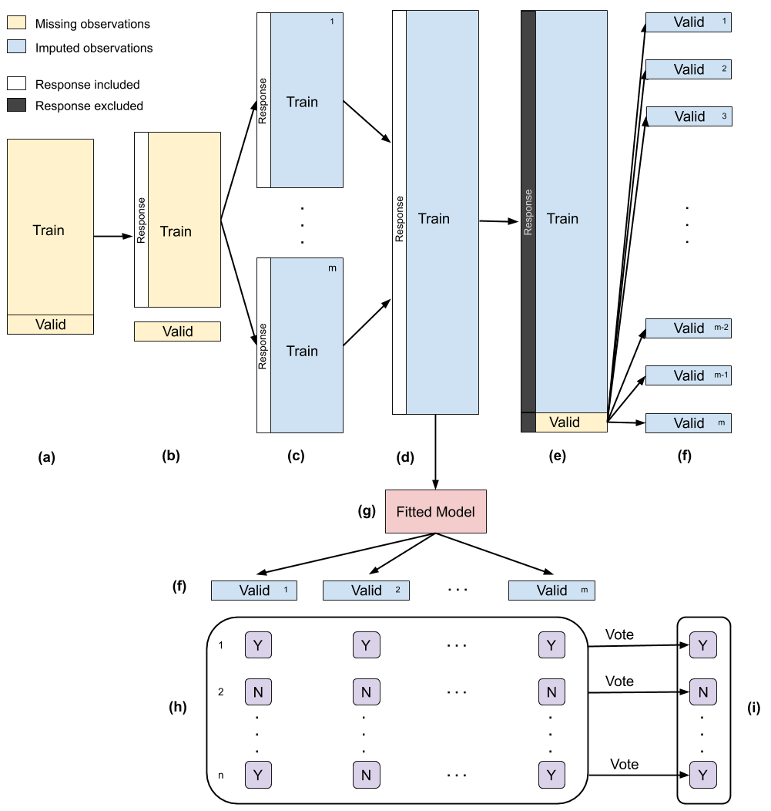

---
title: "Ensemble Multiple Imputation: An Ensemble Approach to using Multiple Imputation and Cross-Validation for Classification"
thesis: MASTER THESIS
major: Biostatistics
output:
  pdf_document:
    number_sections: yes
    fig_caption: yes
    fig_crop: no
    keep_tex: yes
  latex_engine: xelatex
  includes:
    in_header: preamble-latex.tex
    before_body: before_body.tex
    
tables: true
mainfont: Calibri Light
fontsize: 12pt
geometry: "left=1in,right=1in,top=1in,bottom=1in"

bibliography: bibliography.bib
csl: pnas.csl
link-citations: yes

header-includes: 
  \usepackage[bottom]{footmisc}
  \usepackage{float}
  \floatplacement{figure}{H}
  \usepackage{color}
  \usepackage[table]{xcolor}
  \usepackage{multirow}
  \usepackage{caption}
  \captionsetup[table]{skip=5pt, font=footnotesize} 
  \usepackage[font=footnotesize]{caption} 
  \usepackage{algorithm2e}
  \usepackage{amsmath}
  \newcommand{\appendixA}{
    \setcounter{table}{0}  
    \renewcommand{\thetable}{A\arabic{table}} 
    \setcounter{figure}{0} 
    \renewcommand{\thefigure}{A\arabic{figure}}
  }
  \newcommand{\appendixB}{
    \setcounter{table}{0}  
    \renewcommand{\thetable}{B\arabic{table}} 
    \setcounter{figure}{0} 
    \renewcommand{\thefigure}{B\arabic{figure}}
  }
  \newcommand{\appendixC}{
    \setcounter{table}{0}  
    \renewcommand{\thetable}{C\arabic{table}} 
    \setcounter{figure}{0} 
    \renewcommand{\thefigure}{C\arabic{figure}}
  }
    \newcommand{\appendixD}{
    \setcounter{table}{0}  
    \renewcommand{\thetable}{D\arabic{table}} 
    \setcounter{figure}{0} 
    \renewcommand{\thefigure}{D\arabic{figure}}
  }
  \newcommand{\appendixE}{
    \setcounter{table}{0}  
    \renewcommand{\thetable}{E\arabic{table}} 
    \setcounter{figure}{0} 
    \renewcommand{\thefigure}{E\arabic{figure}}
  }
  
---

```{r setup, include=FALSE, echo = FALSE, eval = TRUE}
knitr::opts_chunk$set(echo = TRUE, 
                      eval = TRUE, 
                      warning = FALSE, 
                      message = FALSE, 
                      comment = NA, 
                      cache = TRUE,
                      fig.pos = 'H', 
                      fig.align = 'center',
                      fig.path = 'figure/graphics-',
                      cache.path = 'cache/graphics-'
                      )
options()
```

```{r libraries, echo = FALSE, eval = TRUE, warning = FALSE, message = FALSE}
source("../project/_settings/libraries.R")
source("../project/_settings/functions.R")

load("../project/data/processed-data.RData")
```


\vspace{4cm}
\begin{center}
Robert Edwards 

\vspace{0.125cm}
2416963E


\vspace{1cm}
MASTERS THESIS 

\vspace{0.125cm}
Biostatistics

\vspace{9cm}
  \includegraphics[height = 1.5cm]{images/GUlogo.png}
\end{center}


\newpage
\begin{center}
~
 
\vspace{5cm}
Acknowledgements 

\vspace{3cm}
To my peers, alone we are biased, together we are unbiased.

\vspace{1cm}
To my family, for keeping me sane in the bipolar Scottish weather. 

\vspace{1cm}
To my friends, for your unbiased indulgence in my regressive statistical puns. 

\vspace{1cm}
To my non-Gaussian friends, you increased the variance on the objectively Normal days. 

\end{center}


\newpage 
\setcounter{tocdepth}{2}
\tableofcontents  


\newpage
#Introduction

Prediction in medical data can often be difficult due to a low number of observations and poor predictive covariates.  If the response class distributions are imbalanced, then prediction becomes even more difficult.  Some of these issues arise from the experimental design of the study or for reasons beyond the control of the researcher but little can be rememdied post-hoc.  Missing values in the data complicate the analysis even further and are often handled either by dropping missing observations or filling in the missing value by the mean.  Both methods can be valid if certain assumptions hold, but useful information is lost and these approaches bias estimates of means, regression coefficients, and correlations [@van_buuren_flexible_2012, pp.8; @schafer_missing_2002].  Several statistical methods have been proposed for handling missing data [@schafer_missing_2002]; simple proceedures include complete case analysis (CC) wherein all observations with missing data are excluded, single imputation methods that simply use the mean to replace the missing value, and more principled methods such as multiple imputation (MI).   Multiple imputation is a widely used flexible method in datasets with missing values.  MI is commonly used in medical studies [@powney_review_2014;@karahalios_review_2012;@wood_are_2004] but how it is implemented is often not stated [@mackinnon_use_2010;@hayati_rezvan_rise_2015].


##Study Population & Data Description

This paper investigates predicting survival of patients diagnosed with Acute Respiratory Distress Syndrom (ARDS) after treatment with Extracorporeal Membrane Oxygenation (ECMO).  ARDS is a common and often fatal cause of respiratory failure among patients who are critically ill, with an estimated global prevalence of 10% and a mortality of 25-40% [@bellani_epidemiology_2016; @rubenfeld_epidemiology_2007; @fan_acute_2018; @paolone_extracorporeal_2017].  ARDS has many disease paths and is characterized by rapid onset of widespread inflammation in the lungs [@fan_acute_2018].  ECMO is a complicated and invasive proceedure intended as a supportive care treatment, yet is quickly being adopted as a primary treatment for severe ARDS patients [@park_extracorporeal_2011].  ARDS patients who have undergone ECMO treatment show lower morbidity and mortality rates than those not considered for ECMO treatment [@wallace_ave_2010].  Follow-up studies [@sahetya_survival_2018] have reported favorable outcome in younger ARDS patients treated with ECMO  with fewer comorbid conditions.  Identifying the mortality risk of patients before treatment is of growing interest.  Clinical studies in the U.S. [@calfee_acute_2018] and U.K. [@sinha_latent_2018] have identified two ARDS subphenotypes have been identified with distinct clinical and biological features that are thought to support predictive strategies.  

The dataset is composed of 450 observations on patients with ARDS who underwent ECMO treatment.  The response variable, `ECMO_Survival`, is a binary categorical variable for survival indication with levels "Y" and "N".  There are 33 covariates included in the analysis, two of which are categorical, and 31 continuous.  The categorical variable `Gender` has two levels, "m" and "f", and `Indication` is a seven level nominal categorical indicator of disease type.  The continuous variable `Age` is also included in the analysis with a minimum age of 18 and a maximum of 83 with a median age of 53.  The remaining variables are biomedical markers from hospital measurements.   
  

##Aims of the Proposed Research

The main questions of interest investigated in this paper are:

1. Can ECMO treatment survival (`ECMO_Survival`) be accurately predicted by PreECMO biomedical markers?
2. What is the future expected performance of predictions?
3. Which biomedical markers are needed for accurate prediction and which can be dropped?


To further the goals of this paper, multiple imputation is investigated for increasing prediction performance on ECMO treatment survival.  This method allows observations with missing data to be retained and accounts for the uncertainty of the imputed values.  The advantages come at the cost of complexity and increased computation time; multiple datasets are be imputed and results are to be pooled.  

This paper begins by explaining how the data are cleaned and an explanation of the proceedure to pool results from MI in cross-validation.  An explanantion of imputaiton methods follows.  An explanation of the considered classification methods and how each is implemented then follows.  Lastly, the results from predictions on each imputed data set are discussed. 


\newpage
#Methodology


##PreProcessing

Before analysis the data are standardised by mean-centering and scaling so the standard deviation is 1.  The standardizing of variables in important in classification because variables measured at different scales do not contribute equally to the analysis.  For example, the K-Nearest Neighbors method uses a distance metric to distinguish classes; a variable on a scale of 0 to 100 will be analyzed differently than a variable with a range of 0 to 1.  

In addition to standardizing, the continuous variables are also transformed so the distributional form of the data is multivariate normal.  Some nonparametric classification methods assume the data is multivariate normally distributed and can have better prediction performance if the assumption is true.  Van Buuren [-@van_buuren_flexible_2012, pp.106-107] also suggests transforming the data toward normailty for multiple imputation.  The data are transformed using the Yeo-Johnson transformation [@yeo_new_2000].  The Yeo-Johnson transformation is similar to a Box-Cox transformation except it can accomodate covariate with zero and/or negative values.  


##Validation & Cross-validation

When building a classification model, it is important to asses its ability to produce valid predictions.  If there are ample number of observations, one way to asses model performance is to randomly split the dataset into training, validation, and test sets.  The training set is used to fit the model, which is then used to predict the classes for the observations in the validation set;  the validation set is used to estimate prediction error and tune hyperparameters for model selection; the test set is used to estimate future prediction performance for the model/hyperparameters chosen.  To simulate the model predicting on future, unseen data, the test set should be kept isolated.  The model can  overfit the data if feature manipulation and hyperparamter tuning are done before randomly splitting the data.  If standarzation and transformation of the covariates is done on the entire dataset, information from the training set can "leak" into the test set and the true test error will be underestimated. 

If there is insufficient data to split into three parts then a suitable alternative is $K$-fold cross-validation.  It is one of the simplest and most widely used method for estimating prediction error [@hastie_elements_2009].  The data is randomly split into $K$ folds, where the $K^{th}$ fold is taken as the validation set and the the remaining $K-1$ folds are used for training the model.  The procedure is then repeated $K$ times and the prediction error averaged.  $K$-fold cross validation is most useful on sparse datasets as it allows more observations to be used in training the model.  The choice of $K$ can effect the variability of the prediction error; if $K=1$, the model will overfit the data and prediction error will be highly variable and if $K=n$ (the number of observation in the dataset), the model is fit with no validation set for training parameters.  Typical values used are $K=5$ & $10$ [@hastie_elements_2009; @breiman_submodel_1992; @kohavi_study_1995]. 


##Models

There are many classification methods, some perform well on many types of data and others perform better on certain types of data.  A variety of classification methods are explored toward the aim of predicting survival of ECMO treatment, including parametric methods with many assumptions and high bias as well as non-parametric methods with higher variability.  The five methods explored on the ARDS dataset in this paper are: Logistic Regression, Linear Discriminant Analysis, Quadratic Discriminant Analysis, K-Nearest Neighbors, and Random Forests.  


$~$  
*Logistic Regression*  

Logistic regression is a widely used approach in machine learning and medicine for binary classification.  It is a generalisation of linear regression that models the posterior probabilities of the $Y$ classes.   A logit link is used to ensure the posterior probabilities sum to one and are bounded by [0,1].  For two classes, let $Y_i$ be independent Bernoulli random variables, then the model has the form

$$
\text{logit} \Big( \text{Pr}(Y_i \vert X_i) \Big) = \text{log} \frac{ \text{Pr}(Y_i=1 \vert X_i) }{ \text{Pr}(Y_i=2 \vert X_i) }  = \mathbf{x}^T_i\boldsymbol{\beta}  \tag{1}
$$

where $\mathbf{x}^T_i$ is the design matrix for observation $i$.  The posterior probabilities are estimated by maximizing the log-likelihood function to find the parameter estimates, $\hat{\boldsymbol{\beta}}$, to obtain estimates of the probabilities:

$$
\text{Pr}(Y_i=1 \vert X_i) = \frac{ \text{exp}(\mathbf{x}^T_i \hat{\boldsymbol{\beta}}) }{ 1 + \text{exp}(\mathbf{x}^T_i \hat{\boldsymbol{\beta}}) }  \tag{2}
$$

Logitistic Regression (Logit) is implemented with a logit link function using the `"glmnet"` method in the *caret* package [@wing_caret:_2019].  The parameters settings are `alpha = 1` and `lambda = 0` to suppress regularization.


$~$  
*LDA and QDA*  

Discriminant Analysis is a widely used set of classification methods.  A generlization of Fisher's Linear Discriminant [@fisher_use_1936],  discriminant functions are created through a combination of the explanatory variables that characterize the classes.  

Let $p(X_i \vert Y_i)$ be the densities of distributions of the observations for each class where $Y_i$ are independent Bernoulli random variables and let $\pi_{Y_i}$ denote the prior probabilities of the $Y^{th}_i$ class; that is, the prior probability that a randomly sampled observation belongs to the $Y_i^{th}$ class based on the class proportions.  The posterior probabilities may be written using Bayes Theorem as:

$$
p(Y_i \vert X_i) = \frac{p(X_i \vert Y_i) ~\pi_{Y_i}}{p(X_i)} \propto p(X_i \vert Y_i) ~\pi_{Y_i}   \tag{3}
$$

Suppose the class distribution for class $Y_i$ is Multivariate Normal with mean $\mu_{Y_i}$ and covariance matrix $\Sigma_{Y_i}$, so that:

$$
p(X_i \vert Y_i) = \frac{1}{(2 \pi_{Y_i})^{p/2} \vert\boldsymbol{\Sigma}_{Y_i} \vert ^{1/2}} \text{exp} \left[-\frac{1}{2}(X - \mu_{Y_i})^T \boldsymbol{\Sigma}^{-1}_{Y_i}(X - \mu_{Y_i})  \right]  \tag{4}
$$

In comparing two classes, it is sufficient to look at the log-ratio:
$$
\text{log} \frac{\text{Pr}(Y_i=1 \vert X_i)}{\text{Pr}(Y_i=2 \vert X_i)} = \text{log}\frac{p(X_i \vert Y_i=1)}{p(X_i \vert Y_i=2)} + \text{log}\frac{\pi_1}{\pi_2}   \tag{5}
$$

and using Bayes Discriminant Rule stating that *an observation should be allocated to the class with the largest posterior probability*.  From Equation (1), the posterior probability may be written as
$$
p(Y_i \vert X_i) \propto \text{exp} \left( Q_{Y_i} \right)    \tag{6}
$$

where discriminant function is

$$
Q_{Y_i} = (X_i - \mu_{Y_i}) \Sigma^{-1}_{Y_i} (X - \mu_{Y_i})^T + \text{log} \vert \Sigma_{Y_i} \vert - 2\text{log} ~\pi_{Y_i}   \tag{7}
$$

for class $Y$.  The Bayes Discriminant Rule is then: *allocated the observation to the class with the largest discriminant function, $Q_Y$*.  This method of classification is called *Quadratic Discriminant Analysis* (QDA) because the decision boundaries between classes are elliptical and defined by $Q_Y$, an equation quadratic in $X$.  If the covariance matrix, $\Sigma_Y$ is assumed to be equal for each class then the discriminant function is defined as

$$
L_Y = X \Sigma^{-1} \mu_Y^T -\frac{1}{2}\mu_Y \Sigma^{-1} \mu_Y^T  - \text{log} ~\pi_Y     \tag{8}
$$

This method has linear decision boundaries between classes defined by $L_Y$, an equation linear in $X$, and is known ad *Linear Discriminant Analysis* (LDA).  The Bayes Discriminant Rule is then: *allocated the observation to the class with the largest discriminant function, $L_Y$*. 

These methods come with disadvantages.  Firstly, there is a bias-variance trade-off; both assume the covariates are normally distributed, there is no multicollinearity, and the observations are independent [@cover_geometrical_1965].  LDA additionally assumes equal class covariances.  Discriminant Analysis can only utilize continuous covariates with no missing observations.  The bias from simple linear or quadratic class boundaries can be acceptable because  it is estimated with less variance.  Despite the many assumptions and limitations, both LDA and QDA are widely used and perform well on on a diverse set of classification tasks [@hastie_elements_2009], even when the classes are not normally distributed.  

LDA and QDA are implemented using the `"lda"` and `"qda"` methods in the *caret* package [@wing_caret:_2019].  


$~$  
*K-Nearest Neighbors*  

$K$-Nearest Neighbors (KNN) is a commonly used non-parametric classification method.  To predict the class of a new observation, a distance matrix is constructed between all observations and the K nearest labelled observations to the new observation are considered.  The new observation is then assigned the class label that the majority of its neighbors share.  In case of only two classes, ties in class assignments are avoided by using odd values of K.  In the event of a tie, a class can be chosen at random.  Various distance metrics may be used but it is common to use Euclidean distance to determine the closest training points, though it is advisable to scale variables so that one direction does not dominate the classification [@hastie_elements_2009, pp.456].  KNN is sensitive to the local structure of the data.  As $K$ increases, the variability of the classification tends to decrease at the expense of increased bias.  

KNN is implemented using the `"kknn"` method in the *caret* package [@wing_caret:_2019] with a grid search over the number of observations considered in classifying a new observation, $k=3,...,19$.  A Gaussian kernel and Euclidean distances are used.  


$~$  
*Random Forests*   

Random Forests [@breiman_random_2001] are one of the most successful general-purpose modern algorithms[@biau_random_2016].  They are an ensemble learning method that can be applied to a wide range of tasks, namely classification and regression.  A random forest is created by building multiple decision trees, where randomness is introduced during the construction of each tree.  Predictions are made by classifying a new observation to the mode of the multiple decisions tree classifications.  Random forests often make accurate and robust predictions, even for very high-dimensional problems[@biau_analysis_2012].  See Figure \ref{alg:random-forests-alg} in Appendix B for an explanation of the random forests algorithm.  Random Forests (RF) are implemented using the `"rf"` method in the *caret* package [@wing_caret:_2019] with a grid search over the number of variables considered at each split, $mtry=3,...,15$.  


##Accuracy Metrics

A classification method is typically assesed using a confusion matrix.  Table \ref{tab:confusion-matrix} represents a confusion matrix for a binary classification. 

```{r, echo = FALSE, eval = TRUE, warning = FALSE, message = FALSE, out.width = '100%', fig.align="center", fig.pos="H"}

xtab <- matrix(c("a", "b", "c", "d"), nrow = 2, byrow = TRUE)
response <- matrix(c("N", "Y"), nrow=2, byrow = TRUE)
predicted <- matrix(c("Predicted", "Predicted"), nrow=2, byrow = TRUE)
xtab <- cbind(predicted, response, xtab)
colnames(xtab) <- c(" ", " ", "N", "Y")

xtab %>%
  kable(format = "latex", 
        align = c("l", "c", "|c", "c"), 
        booktabs = TRUE,
        caption = '\\label{tab:confusion-matrix} Confusion matrix for two classes.') %>%
    kable_styling(font_size = 12, 
                  latex_options = c("hold_position", "striped")) %>%
  column_spec(1, bold = T) %>%
  collapse_rows(columns = 1:2, valign = "middle", latex_hline = "none") %>%
  add_header_above(c(" " = 2, "Observed" = 2), bold = FALSE) 
  
```

Accuracy is the percentage of correctly classifies instances out of all instances.  It is often a poor performance metric to use alone.  There are two significant problems with it.  Firstly, accuracy applies a naive 0.50 threshold to decide between classes, and this is usually wrong when the classes are imbalanced. Second, classification accuracy is based on a simple count of the errors.  It does not provide information on which classes are being improperly classified or where.  For the two class confusion matrix in Table \ref{tab:confusion-matrix} accuracy is defined as: 

$$
\text{accuracy} = \frac{a+d}{a+b+c+d} 
$$

For binary classification, sensitivity and specificity provide more insight into performance of a classifier.  These are defined as: 


$$
\begin{aligned}
\text{sensitivity} &= \frac{a}{a+c} \\
\text{specificity} &= \frac{d}{b+d}
\end{aligned}
$$
Here, sensitivity is a measure of how accurately non-survival is predicted, specificity is a measure of how accurately survival is predicted, and accuracy is a measure of how well both survival and non-survival are predicted.  While sensitivity and specificity state the accuracy of each class prediction, accuracy is a poor measure for model performance in an imbalanced dataset.  On the ARDS datasets, for example, if `ECMO_Survival` is predicted to be "Y" for all cases, then the accuracy is 75% but the prediction is no better than the baseline likelihood of the class proportions.   


$~$  
*Cohen's Kappa*  

Kappa or Cohen’s Kappa [@cohen_coefficient_1960] is a classification performance metric that is normalized at the baseline of random chance on the dataset. It is a useful performance measure on problems with imbalanced classes.  Kappa is defined as:

$$
\kappa = \frac{p_o - p_e}{1 - p_e}
$$
where $p_o$ is simply the accuracy, the relative observed agreement between observed and predicted classes and $p_e$ is the probability of chance agreement based on the class probabilities.
$$
p_o = \frac{a+d}{a+b+c+d}  ~~~~~\text{and}~~~~~ p_e = p_{o,Y} + p_{o,N} 
$$

where
$$
\begin{aligned}
p_{o,Y} &= \frac{a+d}{a+b+c+d} ~\cdot~ \frac{a+c}{a+b+c+d} \\
p_{o,N} &= \frac{c+d}{a+b+c+d} ~\cdot~ \frac{b+d}{a+b+c+d}
\end{aligned}
$$

Kappa is used in this paper to compare the performance of different classifiers.  A classifier with a larger Kappa is considered to predict better than a classifier with a lower Kappa.  If all the observations are predicted correctly then $\kappa=1$.  If the observations are predicted no better than expected by the class probabilities, $p_e$ then $\kappa=0$.  If all the observations are predicted incorrectly, then $\kappa=-1$.  A positive $\kappa$ indicates that the model predicts better than would be expected by chance whereas a negative $\kappa$ indicates that the model predicts worse than would be expected by chance.  


##Missing Data

Missing data is a common problem that must be dealt with in machine learning, statistics, and medicine.  Understanding the missing mechanism for the missing observations is important in the analysis.  Rubin [@rubin_inference_1976] defined three types of missing data mechanisms: missing completely at random (MCAR), missing at random (MAR), and missing not at random (MNAR).  The data are said to be missing completely at random (MCAR) if the probability of being missing is the same for all cases.  This implies the causes of the missing data are unrelated to the data itself.  While MCAR is convenient because it allows many complexities that arise because of missing data to be ignored, it is typically an unrealistic assumption [@van_buuren_flexible_2012].  The data is said to be MAR if the probability of being missing is the same only within groups defined by the observed data.  MAR is a more general and more realistic assumption than MCAR.  If neither MCAR nor MAR applies, then the probability of being missing depends on an unknown mechanism and said to be MNAR.  Most simple approaches to dealing with missing data are only valid under MCAR assumption.  Modern methods to dealing with missing data begin from the MAR assumption.  


##Imputation Methods

*Complete Case Analysis*  

Complete case canalysis is a convenient method for handling missing data and is the default method in many statistical packages.  If there is a missing value in an observation, it is dropped from the analysis.  This is often a poor approach as complete cases analysis assumes MCAR.  In sparse datasets a complete case analysis can cause an analysis to be underpowered and if MCAR does not hold, can severely bias estimates of means, regression coefficients, and correlations [@van_buuren_flexible_2012].  


$~$  
*Mean Imputation*  

Another common method for handling missing data is mean imputation; the missing value is replaced by the mean of the observed values (the mode for categorical data).  This approach is satisfactory for a moderate amount of MCAR-generated  missing  values.  However, it  distorts  the distribution of the data by reducing the variance of the imputed variables and the correlations between variables [@little_bayes_2014].  Van Buuren  suggests mean imputation should only be used only when there are few missing values, and should be generally avoided [@van_buuren_flexible_2012].  Mean imputation (SI1) is implemented using the `"mean"` method in the *micemd* package with the number of imputations set as $m=1$.  


$~$  
*Multiple Imputation*  

Multiple imputation is a method that accounts for the uncertainty in the imputed values.  The observed dataset is imputed multiple times to create $m>1$ complete datasets.  The imputed values are drawn from a distribution specifically modeled for each missing entry.  The $m$ datasets are analyzed using the same method that would have been used had the data been complete.  The results will differ because of the variation in the input data caused by the uncertainty in the imputed values.  

Multiple imputation can handle data that is both MAR and MNAR.  

There is uncertainty as to the true value of the unseen data, and that uncertainty should be included in the analysis.  Multiple imputation is a method created by Donald Rubin wherein multiple datasets are imputed, the analysis is conducted on each dataset, and the results are pooled.  Details of the *MICE* algorithm can be found in Algorithm \ref{alg:mice-alg}.  

$~$  
*Predictive Mean Matching*  

Many methods can be used to predict the missing value in the *MICE* algorithm (Algorithm \ref{alg:mice-alg}) in Appendix B.  Predictive Mean Matching [@rubin_statistical_1986; @little_missing-data_1988] (PMM) is used as the imputation method for MI of the ARDS.  It is a versatile method robust to transformations of the target variable [@van_buuren_flexible_2012, pp. 69].  PMM uses the observed values to make realistic imputations.  Meaningless imputations are avoided because imputed values are always contained within the range of the observed data.  PMM is also less vulnerable to model misspecification than other methods because the model is implicit, the distribution of missing values is based on the observed data rather than an explicit model [@little_bayes_2014].  The algoritm as outlined by Van Buuren @van_buuren_flexible_2012 pp. 57-58, is defined in Algorithm \ref{alg:pmm-alg}.  

Let $y$ be the vector of observed and imputed values where $y_{\text{obs}}$ is the vector of $n_1$ observed values and $\dot{y}$ is the vector of $n_0$ imputed values.  Then let $X$ be the design matrix of predictors where $X_{\text{obs}}$ indicates the subset of $n_1$ rows of $X$ for which $y$ is observed and $X_{\text{mis}}$ is the subset of $n_0$ rows for which $y$ is missing.  Then Bayesian multiple imputation is specified as

$$
\dot{y} = \dot{\beta}_0 + X_{\text{obs}}\dot{\beta}_1 + \dot{\epsilon} ~~~~~\text{where}~~~~~ \dot{\epsilon} \sim N(0, \dot{\sigma}^2)   \tag{9}
$$
where $\dot{\beta}_0$, $\dot{\beta}_1$, and $\dot{\sigma}$ are random draws from their posterior distribution, given the data.  Imputations are drawn under the normal linear model using non-informative priors for each parameter.  

Multiple imputation is implemented using the `"pmm"` method in the *micemd* package [@team_micemd:_2019] with $maxit = 5$ and with the number of imputations set as $m=9$ and $m=99$.  


##Ensemble Multiple Imputation

While the topic of multiple imputation has been widely researched, how to best use multiple imputation in conjunction with cross-validation has not.  Two approaches have been proposed for pooling results from several SVMs [@belanche_handling_2014] and Cox regression [@zavrakidis_combining_2017] from multiply imputed datasets.  The method is to concatenate the $m$ imputed datasets and fit a classifier, and optimize, to the resulting set; this accounts for the variability of the parameter estimates as well as the variability of the training observations in relation to the imputed values [@belanche_handling_2014].  The second proceedure fits separate classifiers to each imputed data set and get the pooled (i.e. avereaged) performance of the $m$ classifiers.  Results from both studies either show similar results between appraoches [@zavrakidis_combining_2017] or slightly better performance with the first approach [@belanche_handling_2014].  For simplicity and the sake of computational costs, this paper, only considers the first approach as outlined in Figure \ref{fig:ensemble-imputation}.     

The Algorithm \ref{alg:ensemble-imputation} describes the steps of the ensemble approach for multiply imputed data in k-fold cross-validation: 

\begin{algorithm}[H]
\label{alg:ensemble-imputation}
\caption{One iteration in the cross-validation step of ensemble multiple imputation.}
\DontPrintSemicolon
\SetAlgoLined
\BlankLine

\begin{enumerate}
  \item Randomly partition the training data into $k$ folds while retaining class proportions;
  \item Define the $k^{th}$ as the validation set and the remaining $k-1$ folds as the training set;
  \item Impute the training set $m$ times, with the response variable included, to create $m$ imputed training sets;
  \item Concatenate the $m$ imputed training sets into one extended training set;
  \item A model is fitted to the extended training set;
  \item The validation set is concatenated with the extended training set;
  \item Impute the combined validation and extended training set, with the response variable excluded, to create $m$ imputed combined validation and extended training sets;
  \item Extract the $m$ validation sets;
  \item Make $m$ predictions on the $m$ imputed validation sets;
  \item Take the majority vote of the $m$ predictions as the prediction for the fitted model;
  \item Validate the prediction against the validation set by calculating Cohen's Kappa (note there are no missing values for the response variable in the data);
  \item Repeat steps 2-11 $k$ times and validate the fitted model on each training set against the test set for each fold;
  \item Average the $k$ calculated Cohen's Kappas as the estimated in-sample performance.
\end{enumerate}

\BlankLine
\end{algorithm} 

```{r , echo = FALSE, eval = TRUE, fig.pos="H", fig.align = 'center', out.width = '100%', fig.cap = "\\label{fig:ensemble-imputation}Outline of Kth step in the ensemble algorithm used to combine MI in cross-validation.  (a) The Kth fold is taken as the test set (valid) and the remaining K-1 folds are taken as the training set. (b) Valid is separated from the analysis. (c) Train is imputed m times with the response included. (d) The m imputed datasets are 'stacked' to form one training set.  (e) Valid is concatenated with the imputed and 'stacked' training set.  (f) The test set is imputed m times using the imputed training set without the response included.  (g) A model is fitted to the imputed and 'stacked' training set.  (h) The fitted model makes predictions on each of the m valid sets.  (i) The m predictions are pooled by a majority vote."}

```

\newpage  
"Rubin's Rules" [@rubin_inference_1976] provide a simple method for pooling parameters estimates from multiple imputation for linear and generalized linear models but to the author's knowledge, there has been insufficient work on estimating the required number of imputations for estimating posterior probabilities in classification problems.  The classic advice for the choice of $m$ is between 3 and 5 for moderate amounts of missing information but it is often beneficial to set $m$ higher and create between 20-100 imputations [@van_buuren_flexible_2012, pp.112-113]. 

There has been sufficient exploration into pooling of posterior probabilities resulting from classification problems [@kittler_combining_1996; @james_majority_1998], but there has been little research into the pooling of predictions in classification problems on multiply imputed datasets [@belanche_handling_2014].  Pooling multiple predictions can be implemented using a variety of strategies, among which majority vote is one of the simplest, and has been found to be just as effective as more complicated schemes [@lam_optimal_1995].  Indeed, others have pooled predictions from various classification methods by taking the majority vote [@james_majority_1998; @belanche_handling_2014] and comparing prediction performance.

This study involved four phases: (a) complete case analysis (CC) with the variable `PreECMO_Albumin` dropped from the analysis due to `r round( sum(is.na(data_clean.df$PreECMO_Albumin))/450 * 100, 2)`% missingness, (b) mean imputation (SI1) on variables with missing values, (c) imputation via the MICE algorithm implemented with PMM for $m=9$ imputed datasets (MI9), and (d) imputation via the MICE algorithm implemented with PMM for $m=99$ imputed datasets (MI99).  In each phase  the data is first randomly stratified into 75% training and 25% test sets, with the test set held-out.  Five classification models are trained (Logit, KNN, LDA, QDA, RF) and tuned in 10-fold cross-validation using the ensemble imputation described in Figure \ref{fig:ensemble-imputation}.  To determine the expected performance of future predictions, one iteration of the ensemble imputation is conducted for the full training set, the held-out test set, and the tuned classification methods.  


##Feature Selection

One of the goals of this analysis is to identify the variables most useful for accurate prediction.  There are various methods that can be used for feature selection: stepwise selection, Recursive Feature Elimination (RFE), LASSO regularization, and principle Component Analysis (PCA).  However, some of these methods are either highly criticized, dependent on the classification method considered, or cannot be integrated into the ensemble cross-validation approach used.  Stepwise selection, while very common, is only applicable to regression models and it is often criticised [@kemp_applied_2003]; problems include falsely narrow confidence intervals for effects and predicted values [@altman_bootstrap_1989] and multiple hypothesis testing inflating risks of capitalising on chance features of the data [@altman_practical_1991], such as noise covariates gaining entry into the model when the number of candidate variables is large [@derksen_backward_1992].  RFE is an iterative procedure analogous of backward feature selection.  A new classifier is trained on a subset of the features and the importance of the feature is a measure of the change in performance.  The training time scales linearly with the number of classifiers to be trained [@guyon_gene_2002].  Both logistic regression with LASSO regularization [@tibshirani_regression_1996] and the analogous Sparse Discriminant Analysis [@clemmensen_sparse_2011] are embedded feature selection methods that are dependent on the classification method.  


Principle Component Analysis (PCA) [@f.r.s_liii._1901] is a feature extraction method that is independent of the classification method.  The training set are orthogonally transformed into new uncorrelated variables called principle components that are linear combinations of the original variables.  Feature extraction is accomplished by selecting the $k$ largest principle components that contain a chosen percent of the variance in the original feature space.  

PCA can also be used for feature selection by calculating the contribution of each variable to the extracted features [@song_feature_2010].  Let $C_i$ be the contribution of a given variable on the principle component, $\text{V}_i$, and let $\lambda_i$ be the eigenvalue of $\text{V}_i$, where $\text{V}_{i} = \lambda_i \text{C}_i$.  The eigenvalues measure the amount of variation retained by each principle component.  The total contribution of a variable, $\text{C}_j$, on explaining the variations retained by $k$ extracted features, $\text{V}_1, ..., \text{V}_k$, is

$$
\text{C}_j = \sum^k_{i=1} \vert \lambda_{ij} \text{C}_{ij} \vert = \sum^k_{p=1} \vert \text{V}_{ij} \vert   \tag{10}
$$

The $\text{C}_j$ are sorted in descending order where $\text{C}_1$ contributes the most variation to the extracted principle components among all the $\text{C}_j$ for $j=1,2,...p$, variables.  Variables at the beginning of the sorted list are considered more important for the analysis than variables at the end.  Here, any variable that contributes more than the expected average contribution -- that is if all variables contributed equally -- is selected as important for the analysis.  

Variable selection via PCA is independent of the classification method and allows important variables to be identified outside of the classification analysis.  The number of principle components retained, $k$, is based on the proportion of variance retained of the $p$ principle components, where the variance threshold is chosen to be 80%. 


$$
0.8 \leq \frac{\sum^k_{i=1} \lambda_i}{\sum^p_{j=1} \lambda_j}  \tag{11}
$$
The number of principle components retained is based on the proportion of variance.  If the contribution of the $p=30$ continuous variables were uniform, the expected value would be $1/\text{p} =$ `r round(1/30, 2)`.   For a given component, an observation with a contribution larger than this cutoff could be considered as important in contributing to the component.

Variable selection is implemented using the `FactoMineR` package [@husson_factominer:_2019].  


\newpage
#Exploratory Data Analysis

To get an idea of the distribution of the data, the following summary statistics were obtained for the categorical variables in Table \ref{tab:categorical-summaries} and for the continuous variables in Figure \ref{fig:violin-standardised}.

```{r , echo = FALSE, eval = TRUE, warning = FALSE, message = FALSE}
survival <- data_clean.df %>%
  group_by(ECMO_Survival) %>%
  summarise(n(), round(100*n()/nrow(data_clean.df), 2))
survival <- cbind("ECMO_Survival", survival)
names(survival) <- c("Variable", "Level", "n", "%")
  
gender <- data_clean.df %>%
  group_by(Gender) %>%
  summarise(n(), round(100*n()/nrow(data_clean.df), 2))  
gender <- cbind("Gender", gender)
names(gender) <- c("Variable", "Level", "n", "%")

indication <- data_clean.df %>%
  group_by(Indication) %>%
  summarise(n(), round(100*n()/nrow(data_clean.df), 2))
indication <- cbind("Indication", indication)
names(indication) <- c("Variable", "Level", "n", "%")

cat_vars <- rbind(survival, gender, indication)

cat_vars %>%
  kable(col.names = c("Variable", "Level", "n", "%"),
        caption = '\\label{tab:categorical-summaries} Summary statistics for categorical variables.', 
        booktabs = TRUE, 
        align = c("l", "c", "c", "c"),
        format = "latex") %>%
  kable_styling(font_size = 10, 
                latex_options = "hold_position", "striped") %>% 
#  column_spec(2, width = "4em") %>%
  collapse_rows(columns = 1:2, valign = "middle", latex_hline = "major") 
  

```

Table \ref{tab:categorical-summaries} shows that the repsonse variable `ECMO_Survival` is imbalanced; of the `r nrow(data_clean.df)` individuals, only `r round(100*sum(data_clean.df$ECMO_Survival=="Y")/nrow(data_clean.df), 2)`% in the study sample survived ECMO treatment (`r sum(data_clean.df$ECMO_Survival=="Y")` survived vs `r sum(data_clean.df$ECMO_Survival=="N")` did not survive).  The variable `Gender` is also imbalanced with only `r round(100*sum(data_clean.df$Gender == "m")/nrow(data_clean.df), 2)`% of the individuals in the study sample are male (`r sum(data_clean.df$Gender == "m")` male vs `r sum(data_clean.df$Gender == "w")` female).  The distribution disease indication, `Indication` shows a majority are of level 2 and levels 3, 4, and 6 relatively rare occurances in this dataset. 

Many of the standardised continuous variables in Figure \ref{fig:violin-standardised} are highly skewed with a number of outliers.  This can affect the performance of discriminant analysis classification methods that assume a distributional form for the data [@hastie_elements_2009].  The transformed continuous variables are shown in Figure \ref{fig:violin-transformed}

The heatmap in Figure \ref{fig:heatmap-standardised} shows only a few variables with moderate to strong correlation.  Only a few variables, `PreECMO_NAdose` and `PreECMO_Lactate`, are moderately correlated with many other variable.  Feature selection methods based on the correlation matrix may not show strong feature importance for a subset of the variables.  


##Missing Data Exploration

Before imputation, and indeed multiple imputation, it is important to inspect the missingness patterns in the data and check assumptions.  Figure \ref{fig:missing-data} shows the missingness patterns in the dataset, where a black bar represents a missing value.  Many missing values occur in observations with other missing values.  The missing values could be conditionally dependent on other variables, in which case the data would be MAR.  The missing values could also be due to some unknown mechanism at the time of recording (*i.e.* a failure of the measurement device) that happens to effect multiple readings (the biomarkers are measured from blood samples and measurements are likely done in batches).  In this case the data would be MCAR.

```{r, echo = FALSE, eval = TRUE, fig.pos="H", fig.align = 'center', out.width = '100%', fig.cap = "\\label{fig:missing-data}Visual representation of missing observations in the ARDS dataset."}
load("../project/data/processed-data.RData")
vis_miss(data_clean.df, sort_miss = TRUE) +
  theme(  plot.margin = ggplot2::margin(0.125, 2, 0.5, 1, "cm") ) #top, right, bottom, left
```

From Figure \ref{fig:missing-data}, `PreECMO_Albumin` is seen to have 46.44% missingness.  To conserve more observations for the training set, `PreECMO_Albumin` is dropped from the complete case analysis.  Of the remaining variables only half contain missing values with moderate to low missingness up to 6%.  

Table \ref{tab:missing-statistics} provides some measures about variable dependence  in the dataset.  The first column shows the probability of observed values for each variable.  The following are coefficients that give insight into how the variables are connected in terms of missingness.  *Influx* is the ratio of the number of variables pairs $(Y_j, ~Y_k)$ with $Y_j$ missing and $Y_k$ observed, divided by the total number of observed data.  For a variable that is entirely missing, influx is 1, and 0 for if the variable is complete.  *Outflux* is defined in the opposite manner, by dividing the number of pairs $(Y_j, ~Y_k)$ with $Y_j$ observed and $Y_k$ missing, by the total number of complete cells.  For a completely observed variable, outflux will have a value of 1 and 0 if completely missing.  Outflux gives an indication of how useful the variable will be for imputing other variables in the dataset, while influx is an indicator for how easily the variable can be imputed.  Table \ref{tab:missing-statistics} shows that all variables will be useful during impuation with the exception of `PreECMO_Albumin`.  A high outflux variable might turn out to be useless for the imputation procedure if it is unrelated to the incomplete variables, while the usefulness of a highly predictive variables is severely limited by a low outflux value [@van_buuren_flexible_2012].  


\newpage
#Results

## Prediction Performance

This study involved four phases: (a) complete case analysis with the variable `PreECMO_Albumin` dropped from the analysis due to `r round( sum(is.na(data_clean.df$PreECMO_Albumin))/450 * 100, 2)`% missingness, (b) mean imputation on variables with missing values, (c) imputation via the MICE algorithm implemented with PMM for $m=9$ imputed datasets, and (d) imputation via the MICE algorithm implemented with PMM for $m=99$ imputed datasets.  

The dataset was randomly stratified into 75% training and 25% test.  The five classification models were trained in 10-fold cross-validation using the ensemble imputation approach.  Table \ref{tab:cv-kappa} shows the averaged Kappa from each analysis in 10-fold cross-validation.  For CC and SI1, LDA had the highest averaged Kappa, while logistic regression had the highest averaged Kappa for MI9 and MI99.  

```{r, echo = FALSE, eval = TRUE, warning = FALSE, message = FALSE, out.width = '100%'}
load("../project/_trained-models/trained-models-complete-case.RData")
kappa_cc <- as.data.frame(cbind(table_logit[[2]], table_lda[[2]], table_qda[[2]], table_knn$xtabs[[2]], table_rf$xtabs[[2]]) )
kmax_cc <- table_knn$kmax
mtry_cc <- table_rf$mtry

load("../project/_trained-models/trained-models-mean.RData")
kappa_mean <- as.data.frame(cbind(table_logit[[2]], table_lda[[2]], table_qda[[2]], table_knn$xtabs[[2]], table_rf$xtabs[[2]]) )
kmax_mean <- table_knn$kmax
mtry_mean <- table_rf$mtry

load("../project/_trained-models/trained-models-pmm.RData")
kappa_pmm9 <- as.data.frame(cbind(table_logit[[2]], table_lda[[2]], table_qda[[2]], table_knn$xtabs[[2]], table_rf$xtabs[[2]]) )
kmax_pmm9 <- table_knn$kmax
mtry_pmm9 <- table_rf$mtry

load("../project/_trained-models/trained-models-pmm99.RData")
kappa_pmm99 <- as.data.frame(cbind(table_logit[[2]], table_lda[[2]], table_qda[[2]], table_knn$xtabs[[2]], table_rf$xtabs[[2]]) )
kmax_pmm99 <- table_knn$kmax
mtry_pmm99 <- table_rf$mtry

kappa_table <- rbind(kappa_cc, kappa_mean, kappa_pmm9, kappa_pmm99)
kappa_table <- round(kappa_table, 3)
colnames(kappa_table) <- c("Logit", "LDA", "QDA", "KNN", "RF")
rownames(kappa_table) <- c("CC", "SI1", "MI9", "MI99")

cap <- paste0('\\label{tab:cv-kappa} Averaged Cohen\'s Kappa for each model fitted in cross-validation.  The tuned parameters for KNN and RF on each imputation emthod are (a) K=', kmax_cc, ' and mtry=', mtry_cc, '(b) K=', kmax_mean, ' and mtry=', mtry_mean, '(c) K=', kmax_pmm9, ' and mtry=', mtry_pmm9, ' (d) K=', kmax_pmm99, ' and mtry=', mtry_pmm99, ', respectively.')

kappa_table %>%
  kable(#col.names = c("Variables", "Test", "df", "p.value"), 
        caption = cap,
        booktabs = TRUE, 
        format = "latex") %>%
  kable_styling(font_size = 10, 
                latex_options = "hold_position")
```


*Validation on Test Set*  

Using the parameters values learned in cross-validation (see Table \ref{tab:cv-kappa}), models were fit on the full training set and validated against the test set.  Performance statistics are shown in Table \ref{tab:metrics}.  In complete case analysis, KNN with $K=5$ performed the best with $\kappa=0.161$.  For the mean-imputed data, RF was the top performer with $\kappa=0.197$.  For both MI with $m=9$ (MI9) and $m=99$ (MI99), logistic regression outperformed the other classfication methods with $\kappa=0.153$ and $\kappa=0.274$, respectively.  

The highest overall accuracy was $0.777$ using RF on the mean-imputed dataset.  However, the class-specific accuracies were $0.965$ for survival and $0.185$ for non-survival.  The best predictor of non-survival was logistic regression on MI99.  

```{r echo = FALSE, eval = TRUE, warning = FALSE, message = FALSE, out.width = '100%'}
load("../project/_metrics/metrics-complete-case.RData")
load("../project/_trained-models/trained-models-complete-case.RData")
model_names <- rbind("Logit", "LDA", "QDA", "KNN", "RF")
metrics_table_cc <- metrics_table 
metrics_table_cc <- cbind("CC", model_names, metrics_table_cc)
colnames(metrics_table_cc)[1:2] <- c("Method", "Model")
rownames(metrics_table_cc) <- NULL


load("../project/_metrics/metrics-mean.RData")
load("../project/_trained-models/trained-models-mean.RData")
metrics_table_mean <- metrics_table 
metrics_table_mean <- cbind("SI1", model_names, metrics_table_mean)
colnames(metrics_table_mean)[1:2] <- c("Method", "Model")
rownames(metrics_table_mean) <- NULL


load("../project/_metrics/metrics-pmm.RData")
load("../project/_trained-models/trained-models-pmm.RData")
metrics_table_pmm <- metrics_table 
metrics_table_pmm <- cbind("MI9", model_names, metrics_table_pmm)
colnames(metrics_table_pmm)[1:2] <- c("Method", "Model")
rownames(metrics_table_pmm) <- NULL

load("../project/_metrics/metrics-pmm99.RData")
load("../project/_trained-models/trained-models-pmm99.RData")
metrics_table_pmm99 <- metrics_table 
metrics_table_pmm99 <- cbind("MI99", model_names, metrics_table_pmm99)
colnames(metrics_table_pmm99)[1:2] <- c("Method", "Model")
rownames(metrics_table_pmm99) <- NULL

metrics <- rbind(metrics_table_cc, metrics_table_mean, metrics_table_pmm, metrics_table_pmm99)
#metrics <- round(metrics[, 3:ncol(metrics)], 3)

metrics %>%
  select(Method, Model, sensitivity, specificity, accuracy, kappa) %>%
  mutate(accuracy = round(accuracy, 3),
         kappa = round(kappa, 3),
         sensitivity = round(sensitivity, 3),
         specificity = round(specificity, 3)) %>% 

  kable(caption = '\\label{tab:metrics} Pooled performance results of trained models validated on test set.', 
        col.names = c("", "", "Sensitivity", "Specificity", "Accuracy", "Kappa"),
        booktabs = TRUE, 
        align = c("l", "c", "c", "c", "c", "c"),
        format = "latex") %>%
  kable_styling(font_size = 10, 
                latex_options = "hold_position", "striped") %>% 
#  column_spec(2, width = "4em") %>%
  # row_spec(4, bold = T) %>%
  # row_spec(9, bold = T) %>%
  # row_spec(11, bold = T) %>%
  # row_spec(16, bold = T) %>%
  collapse_rows(columns = 1:2, valign = "middle", latex_hline = "major") 
```


##Feature Selection

From the PCA analysis, at least 16 principle components were needed to explain 80% of the variance in the imputed training data and at least 15 principle components for the complete case analysis.  The red dashed lines in Figure \ref{fig:feature-importance-pca} indicate the expected average contribution of each variable to the selected principle components if each variable contributed equally to each principle component.  


```{r , echo = FALSE, eval = TRUE, fig.pos="H", fig.align = 'center', out.width = '100%', fig.cap = "\\label{fig:feature-importance-pca}Contribution of variables to the principle components whose cumulative sum explains >80\\% of the variation in the data."}

load("../project/data/processed-data.RData")
source("../project/_settings/functions.R")
require(FactoMineR) 
require(factoextra)

## Imputation Method: Complete Case
pca_cc <- PCA(data_cc.df, graph = FALSE, ncp = 20)
eigenvalues <- pca_cc$eig
#head(eigenvalues, 20)


## CONTRIBUTIONS OF VARIABLES ON PC1 AND PC2
pca_var1 <- fviz_pca_contrib(pca_cc, 
                             choice = "var", 
                             axes = 1:16, 
                             sortcontrib = "desc",
                             title = "CC",
                             fill = "skyblue3",
                             color = "skyblue3",
                             top = 20,
                             xtickslab.rt = 45,
                             ggtheme = theme_pca()
                             )

## Imputation Method: Mean
data_mean.df <- data_mean.df %>%
  select(-ECMO_Survival, -Gender, -Indication)

#scale all the features,  ncp: number of dimensions kept in the results (by default 5)
pca_mean <- PCA(data_mean.df, graph=FALSE, ncp=20)
eigenvalues <- pca_mean$eig
#head(eigenvalues, 20)

## CONTRIBUTIONS OF VARIABLES ON PC1 AND PC2
pca_var2 <- fviz_pca_contrib(pca_mean, 
                             choice = "var", 
                             axes = 1:16, 
                             sortcontrib = "desc",
                             title = "SI1",
                             fill = "skyblue3",
                             color = "skyblue3",
                             top = 20,
                             xtickslab.rt = 45,
                             ggtheme = theme_pca()
                             )


## Imputation Method: PMM9
data_pmm9.df <- data_pmm9.df %>%
  select(-ECMO_Survival, -Gender, -Indication)

pca_pmm9 <- PCA(data_pmm9.df, graph=FALSE, ncp=20)
eigenvalues <- pca_pmm9$eig
#head(eigenvalues, 20)

## CONTRIBUTIONS OF VARIABLES ON PC1 AND PC2
pca_var3 <- fviz_pca_contrib(pca_pmm9, 
                             choice = "var", 
                             axes = 1:16, 
                             sortcontrib = "desc",
                             title = "MI9",
                             fill = "skyblue3",
                             color = "skyblue3",
                             xtickslab.rt = 45,
                             top = 20,
                             ggtheme = theme_pca()
                             )


## Imputation Method: PMM9
data_pmm99.df <- data_pmm99.df %>%
  select(-ECMO_Survival, -Gender, -Indication)

#scale all the features,  ncp: number of dimensions kept in the results (by default 5)
pca_pmm99 <- PCA(data_pmm99.df, graph=FALSE, ncp=20)
eigenvalues <- pca_pmm99$eig
#head(eigenvalues, 20)

## CONTRIBUTIONS OF VARIABLES ON PC1 AND PC2
pca_var4 <- fviz_pca_contrib(pca_pmm99, 
                             choice = "var", 
                             axes = 1:16, 
                             sortcontrib = "desc",
                             title = "MI99",
                             fill = "skyblue3",
                             color = "skyblue3",
                             xtickslab.rt = 45,
                             top = 20,
                             ggtheme = theme_pca()
                             )

## Create Multiplot
require(gridExtra)
grid.arrange(pca_var1, pca_var2, pca_var3, pca_var4, ncol = 2, top = "Variable Importance")

```


\newpage
#Discussion

Model performance on the imputed datasets were generally better than in complete case analysis.  Non-parametric methods, KNN and RF, performed better on the complete case analysis and single mean imputation while logistic regression performed better on the multiply imputed datasets.  All the methods in each analysis were able to predict survival with $>80\%$ accuracy.  The ability to predict non-survival was the limiting factor in the performance of a method.  Non-survival was best predicted by logistic regression in MI99 with a prediction accuracy of $0.333$.  

Logistic regression performed consistently well in predicting non-survival and performed well for imputation methods except for complete case analysis.  LDA also performed rather consistently for each imputed dataset.  The consistent performance of LDA and logistic regression is not surprising given that they are similar methods, however logistic regression outperforms LDA in each analysis.  LDA can perform better than logistic regression when the covariates are normally distributed [@efron_efficiency_1975], but  LDA is not robust to outliers [@hastie_elements_2009] and Figure \ref{fig:violin-standardised} shows a number of outliers in almost every variable.  Logistic regression is robust to outliers and makes less assumptions than LDA [@hastie_elements_2009] allowing it to generalize better.

There were 136 less observations for complete case analysis than for the other experiments.  Performance metrics have moderate variance due to the non-survival class in the test set only having 27 observations.  Predicting one or two more observations as non-survival can have moderately large effects on Kappa.  The relatively low number of observations compounded by the imbalance in the response classes make prediction difficult.  Low predictive power of the variables make this problem even more difficult.  

A surprising result is that KNN performed the best on CC, $\kappa=0.161$ and also performed better than logistic regression on MI9 ($\kappa=0.153$).  RF performed poorly on CC ($\kappa=0.022$) but was the best performer on SI1 ($\kappa=0.197$) and second best on MI9 and MI99 ($\kappa=0.116$ and $\kappa=0.144$).  The inverse performance of KNN and RF may be surprising but Tang et al. show [@tang_when_2018] that random forests can perform poorly on datasets that work well for nearest-neighbor search problems without sufficient subsampling, due to a lack of diversity.  On the imputed datasets KNN performed relatively poorly but similarly to LDA.  It should be noted that KNN consistently was able to predict non-survival better than other methods, but at the cost of lower accuracy in predicting survival.  QDA consistently performed the worst, no better than random chance based on the class likelihoods ($\kappa \approx 0$), suggesting that the class distributions do not support a quadratic decision boundary.   


$~$  
*Feature Importance*  

The selected variables via PCA were the same for SI1, MI9, and MI99 with some variations in the order of importance.  There were four selected variables in CC that were not selected in the imputed datasets: `PreECMO_IL8`, `PreECMO_Creatinine`, `PreECMO_Platelets`, and `PreECMO_SiL2`.  


##Improvements

One way to increase predictive performance is to include more observations in the analysis.  Obtaining new data to include in the analysis could prove expensive or difficult.  Instead, some observations from the test set could be retained for training the model in a nested cross-validation approach.  The analyses done in this paper would constitute one iteration of the $K_\text{o}$ outer cross-validation iterations where a new test set is selected by stratified randomly sampling, models are trained on the $K_\text{o}-1$ via an inner $K_{i}$-fold cross-validation.  Since the data was originally split into 25% test and 75% train, If $K_\text{o}$ is chosen to be >4, more observations can be retained in the training set.  If $K_\text{o}=10$ were chosen, the prediction models would be trained on 67 more observations.  The outer cross-validtion would then give the expected test prediction since it averages over different training sets [@hastie_elements_2009].  The drawback to nested cross-validation is that the time complexity scales from $O(K_\text{i})$ to $O(K_\text{o}K_\text{i})$.  Indeed, the full time complexity for $m$ imputations and a grid search over $p$ parameters would then be $O(pK_\text{o}K_\text{i}m)$.  

The selected variables considered important in the survival prediction of ARDS patients after ECMO treatment should be verified.  A simple way this can be done is by using only the variables shown as important in Figure \ref{fig:feature-importance-pca} and conducting the ensemble imputation.  Realistically, this can only be done for CC and SI1.  For MI9 and MI99, the important variables should be analysed for each imputed dataset in the ensemble imputation algorithm.  However, this adds another layer of complexity and embedded variable selection methods would be a more suitable option.  Regularized logistic regression could be used to select variables through use of the LASSO [@tibshirani_regression_1996].  LASSO methods have also been developed for LDA and QDA: Sparse Discriminant Analysis [@clemmensen_sparse_2011] and DALASS [@trendafilov_dalass:_2007].  Random forests also naturally select important variables by accumulating the improvement in the split-criterion over all the trees in the forest for each variable [@hastie_elements_2009, pp. 593].  

Weighted predictions can be obtained by pooling posterior probabilities of the predictions using the arithmetic mean.  Kittler et al. [@kittler_combining_1996] show that classifier combination strategies based on the sum (*i.e* arithmetic mean) are less sensitive to errors than strategies based on the product (*i.e* geometric mean) but perform just as well as a majority vote.   When combining predictions using the arithmetic mean, more certain predictions (near 0 or 1) weight the prediction more than uncertain predictions (near 0.5).  Retaining posterior probabilities would allow a choice in posterior probability cutoffs for predictions and allow a performance analysis using ROC.  


##Conclusion

The CC has some distinctly different properties than the imputed datasets; the best classification method was KNN, which performed noteably worse in SI1, MI9, and MI99.  The variables selected as important for the predictions also differed in CC compared to the imputed datasets.  Given the curious results for CC, complete case analysis may not be an appropriate method for handling the missing values on the ARDS dataset.  A more appropriate method would be mean imputation or multiple imputation.  ECMO treatment survival can be predicted slightly better than random chance, $\kappa=0.274$, using logistic regression trained on MI99.  Future expected prediction accuracy for survival and non-survival of ECMO treatment are 0.906 and 0.333, respectively.  Variables deemed important for survival prediction are: `PreECMO_PaCO2`, `PreECMO_pH`, `PreECMO_Be`, `Age`, `PreECMO_PF`, `PreECMO_PMean`, `PreECMO_FiO2`, `PreECMO_Bilirubin`, `PreECMO_Ddimer`, `PreECMO_IL6`, `PreECMO_TNFa`, `PreECMO_Leukocytes`, `PreECMO_CRP`, `PreECMO_MAP`, and `PreECMO_ATIII`.  


\newpage
#Appendices {-}

##A. Additional Exploratory Data Analysis {-}
\appendixA

```{r, echo = FALSE, eval = TRUE, warning = FALSE, message = FALSE, out.width = '75%', fig.align="center", fig.pos="H", fig.cap = "\\label{fig:violin-standardised}Violin plot of standardised continuous variables."}
feature_names <- colnames(data_clean.df[, 4:ncol(data_clean.df)])

data_standard.df <- data_clean.df %>% 
  preProcess( method = c("center", 
                       "scale"
#                       "YeoJohnson"  ## Transformation method
                        )) %>%
  predict(data_clean.df) ## Generate new dataframe

data_standard.df %>% 
  select(-ECMO_Survival, -Gender, -Indication) %>%
  gather(key = Feature, value = Value) %>% 
  ggplot(aes(x = Feature, y = Value, fill = Feature)) +
    geom_violin(scale = "width", 
                draw_quantiles = TRUE,
                trim = TRUE,
                show.legend = FALSE) +
    geom_boxplot(width = 0.35,
                 outlier.size = 0.5) +
    xlab("Features") + 
    ylab("standardised Value") +
    theme_bw() +
    theme(plot.title = element_text(hjust = 0.5),
          legend.position = "none",
          axis.text.x = element_text(angle = 45, hjust = 1))  
```


```{r, echo = FALSE, eval = TRUE, warning = FALSE, message = FALSE, out.width = '75%', fig.align="center", fig.pos="H", fig.cap = "\\label{fig:violin-transformed}Violin plot of standardised and transformed continuous variables."}
feature_names <- colnames(data_clean.df[, 4:ncol(data_clean.df)])

data_standard.df <- data_clean.df %>% 
  preProcess( method = c("center", 
                       "scale",
                       "YeoJohnson"  ## Transformation method
                        )) %>%
  predict(data_clean.df) ## Generate new dataframe

data_standard.df %>% 
  select(-ECMO_Survival, -Gender, -Indication) %>%
  gather(key = Feature, value = Value) %>% 
  ggplot(aes(x = Feature, y = Value, fill = Feature)) +
    geom_violin(scale = "width", 
                draw_quantiles = TRUE,
                trim = TRUE,
                show.legend = FALSE) +
    geom_boxplot(width = 0.35,
                 outlier.size = 0.5) +
    xlab("Features") + 
    ylab("standardised & Transformed Value") +
    theme_bw() +
    theme(plot.title = element_text(hjust = 0.5),
          legend.position = "none",
          axis.text.x = element_text(angle = 45, hjust = 1))  
```


```{r , echo = FALSE, eval = TRUE, fig.pos="H", fig.align = 'center', out.width = '100%', fig.cap = "\\label{fig:heatmap-standardised}Heatmap of standardised and transformed variables."}
# Correlation matrix plot
ggcorr(data_standard.df[, 1:ncol(data_standard.df)], 
       hjust = 0.95, 
       size = 2, 
       label = FALSE, 
       label_size = 1.5, 
       label_alpha = FALSE, 
       layout.exp = 5, 
       legend.position = "bottom", 
       legend.size = 8) +
  guides(fill = guide_colorbar(barwidth = 10, 
                               barheight = 0.5, 
                               title.vjust = 0.75))
#  theme(  plot.margin = margin(1, 1, 1, 1, "cm") ) #top, right, bottom, left
```


```{r , echo = FALSE, eval = FALSE, fig.pos="H", fig.align = 'center', out.width = '100%', fig.cap = "\\label{fig:density}Density plots of standardised variables."}
data_clean.df %>% 
  na.omit() %>%
  select(-Gender, -Indication) %>%
#  gather(key = Feature, value = Value) %>% 
#  ggplot(aes(x = Feature, y = Value, fill = ECMO_Survival)) +
  gather(type, value, 1:20) %>%
  ggplot(aes(x = value, fill = ECMO_Survival)) + 
    geom_density(alpha=0.3) + 
#    plotTheme() + 
    facet_wrap(~ type, scales = "free") + 
    theme(axis.text.x = element_text(angle = 90, vjust = 1)) + 
    labs(title = "Density Plots of Data across Variables")
```


Table \ref{tab:missing-statistics} provides some measures about variable dependence  in the dataset.  The first column shows the probability of observed values for each variable.  The following are coefficients that give insight into how the variables are connected in terms of missingness.  *Influx* is the ratio of the number of variables pairs $(Y_j, ~Y_k)$ with $Y_j$ missing and $Y_k$ observed, divided by the total number of observed data.  For a variable that is entirely missing, influx is 1, and 0 for if the variable is complete.  *Outflux* is defined in the opposite manner, by dividing the number of pairs $(Y_j, ~Y_k)$ with $Y_j$ observed and $Y_k$ missing, by the total number of complete cells.  For a completely observed variable, outflux will have a value of 1 and 0 if completely missing.  Outflux gives an indication of how useful the variable will be for imputing other variables in the dataset, while influx is an indicator for how easily the variable can be imputed.  Table \ref{tab:missing-statistics} shows that all variables will be useful during impuation with the exception of `PreECMO_Albumin`.  A high outflux variable might turn out to be useless for the imputation procedure if it is unrelated to the incomplete variables, while the usefulness of a highly predictive variables is severely limited by a low outflux value [@van_buuren_flexible_2012].  


```{r, echo = FALSE, eval = TRUE, warning = FALSE, message = FALSE, out.width = '100%', fig.align="center", fig.pos="H"}

flux <- flux(data_clean.df)

flux %>%
  round(2) %>%
  select(pobs, influx, outflux) %>%
  kable(col.names = c("Proportion", "Influx", "Outflux"), 
        caption = '\\label{tab:missing-statistics} Missing pattern statistics for variables in dataset.',
        booktabs = TRUE, 
        format = "latex") %>%
  kable_styling(font_size = 10, 
                latex_options = "hold_position") %>%
  row_spec(23, bold = TRUE)
```


\newpage
##B. Algorithms {-}
\appendixB

###Random Forests Algorithm

The random forests algorithm depicted is adapted from [@hastie_elements_2009].  

\begin{algorithm}[H]
\label{alg:random-forests-alg}
\caption{Random Forest Classifier}
\DontPrintSemicolon
\SetAlgoLined
\BlankLine

\begin{enumerate}
  \item For ($b=1$ to B):
    \begin{enumerate}
      \item Draw a bootstrap sample $\mathbf{Z*}$ of the size $N$ from the training data.
      \item Grow a random-forest tree $T_b$ to the bootstrapped data, by recursively repreating the following steps for each terminal node of the tree, until the minimum node size $n_{min}$ is reached.
      \begin{enumerate}
        \item Select $mtry$ variables at random from the $p$ covariates. 
        \item Pick the best covariate/split-point among the $mtry$. 
        \item Split the node into two daughter nodes. 
      \end{enumerate}
    \end{enumerate}
  \item Output the ensemble of trees $\{T_B\}^B_1$
\end{enumerate}
\BlankLine

Let $\hat{Y}_b(x)$ be the class prediction of the $b^{\text{th}}$ random-forest tree.  Then a new observation, $x$, is classified as:

$$\hat{Y}^B_{\text{rf}}(x) = \text{majority vote } \left\{ \hat{Y}_b(x) \right\}^B_1$$

\end{algorithm} 


###MICE Algorithm

The MICE algorithm is adapted from [@van_buuren_flexible_2012].

\begin{algorithm}[H]
\label{alg:mice-alg}
\caption{Multiple Imputation via Chained Equations}
\DontPrintSemicolon
\SetAlgoLined
\BlankLine

\begin{enumerate}
  \item Specify an imputation model $P(Y^{\text{mis}}_j \vert Y^{\text{obs}}_j, Y_{-j}, R)$ for variable $Y_j$ with $j=1,...,p$
  \item For each $j$, fill in starting imputation $Y^0_j$ by random draws from $Y^{\text{obs}}_j$
  \item Repeat for $t=1,...,T:$
  \item Repeat for $j=1,...,p:$
  \item Define $Y^t_{-j} = (Y^t_1,...,T^t_{j-1}, Y^{t-1}_{j+1},..., Y^{t-1}_p)$ as the currently complete data except $Y_j$ 
  \item Draw $\phi^t_j \sim P(\phi^t_j \vert Y^{\text{obs}}_j, Y^t_{-j}, R)$.
  \item Draw imputations from $Y^t_j \sim P(Y^{ \text{mis} }_j \vert Y^{ \text{obs} }_j, Y^t_{-j}, R, \phi^t_j)$.
  \item End repeat $j$.
  \item End repeat $t$.

\end{enumerate}
\BlankLine

\end{algorithm} 


Using Equation 9 imputations are drawn under the normal linear model using non-informative priors for each parameter.  The required inputs are:

+ $y_{\text{obs}}$, the $n_1 \times 1$ vector of observed data in the target variable $y$;
+ $X_{\text{obs}}$, the $n_1 \times q$ matrix of predictors of rows with observed data in $y$;
+ $X_{\text{mis}}$, the $n_0 \times q$ matrix of predictors of rows with missing data in $y$.  

\begin{algorithm}[H]
\label{alg:pmm-alg}
\caption{Imputation of $y$ by predictive mean matching}
\DontPrintSemicolon
\SetAlgoLined
\BlankLine

\begin{enumerate}
  \item Calculate the cross-product matrix $S=X_{\text{obs}}'X_{\text{obs}}$.
  \item Calculate $V = (S + \text{diag}(S)\kappa)^{-1}$, with some small $\kappa$.
  \item Calculate regression weights $\hat{\beta} = V X_{\text{obs}}' y_{\text{obs}}$.
  \item Draw a random variable $\dot{g} \sim \chi^2_{\nu}$ with $\nu = n_1 - q$.
  \item Calculate $\dot{\sigma}^2 = (y_{\text{obs}} - X_{\text{obs}} \hat{\beta})' (y_{\text{obs}} - X_{\text{obs}} \hat{\beta}) / \hat{g}$.
  \item Draw $q$ independent $N(0,1)$ variate in vector $\dot{z}_1$.
  \item Calculate $V^{1/2}$ by Cholesky decomposition.
  \item Calculate $\dot{\beta} = \hat{\beta} + \dot{\sigma} \dot{z}_1 V^{1/2}$.
  \item Calculate $\dot{\eta}(i,j) = \vert X_{\text{obs},[i]} \hat{\beta} - X_{\text{mis},[j]} \dot{\beta} \vert$ with $i=1,...,n_1$ and $j=1,...,n_0$; 
  \item Construct $n_0$ sets $Z_j$, each containing $d$ candidate donors, from $Y_{\text{obs}}$ such that $\sum_d \dot{\eta}(i,j)$ is minimum for all $j=1,...,n_0$.  Break ties randomly;
  \item Draw one donor $i_j$ from $Z_j$ randomly for $j=1,...,n_0$
  \item Calculate imputations $\dot{y}_j - y_{i_j}$ for $j=1,...,n_0$.
\end{enumerate}

\BlankLine
\end{algorithm} 

Where $\kappa$ is a ridge parameter used to avoid problems with singular matrices.  The *mice* package uses $\kappa=1e-05$ as default.  


\newpage
##C. Additional Missing Data Diagnostics {-}
\appendixC


```{r , echo = FALSE, eval = FALSE, fig.pos="H", fig.align = 'center', out.width = '100%', fig.cap = "\\label{fig:missing-data-patterns2}Missing data patterns.  Each row corresponds to a missing data pattern (1=observed, 0=missing).  Rows and columns are sorted in increasing amounts of missing information.  The last column and row contain row and column counts, respectively."}
missing_data_patterns2 <- aggr(data_clean.df, col=mdc(1:2), numbers=TRUE, sortVars=TRUE, labels=names(data_clean.df), cex.axis=.7, gap=3, ylab=c("Proportion of missingness","Missingness Pattern")) +
  theme_bw()
```


###Visual Insepction of Imputations

```{r , echo = FALSE, eval = TRUE, fig.pos="H", fig.align = 'center', out.width = '75%', fig.cap = "\\label{fig:xyplot-mean}Scatterplot of 9 mean imputed datasets."}
## Impute concatenated train and test sets
data_standard.df <- data_clean.df %>% 
  preProcess( method = c("center", 
                       "scale",
                       "YeoJohnson"  ## Transformation method
                        )) %>%
  predict(data_clean.df) ## Generate new dataframe

imp_mean <- micemd::mice.par(data_standard.df, 
                         nnodes = 8,
                         meth = "mean", 
                         m = 5,
                         maxit = 5, 
                         seed = 123, 
                         printFlag = FALSE
                         )

#  imp <- complete(imp6, action = "all") # create list of imputed datasets

xyplot(imp_mean, PreECMO_Albumin ~ PreECMO_ATIII | .imp, pch = 20, cex = 0.5)
```

```{r , echo = FALSE, eval = TRUE, fig.pos="H", fig.align = 'center', out.width = '75%', fig.cap = "\\label{fig:xyplot-pmm}Scatterplot of the $m=9$ imputed datasets for MI9.  Can be extended to show similar results for MI99."}
## Impute concatenated train and test sets
imp_pmm <- micemd::mice.par(data_standard.df, 
                         nnodes = 8,
                         meth = "pmm", 
                         m = 9,
                         maxit = 5, 
                         seed = 123, 
                         printFlag = FALSE
                         )

#  imp <- complete(imp6, action = "all") # create list of imputed datasets

xyplot(imp_pmm, PreECMO_Albumin ~ PreECMO_ATIII | .imp, pch = 20, cex = 0.5)
```


###Convergence Monitoring

```{r , echo = FALSE, eval = TRUE, fig.pos="H", fig.align = 'center', out.width = '75%', fig.cap = "\\label{fig:converge-mean}Mean and standard deviation of the synthetic values plotted against iteration number for SI1.  The $m$ streams should intermingle with one another in convergence, without showing any definite trends.  Convergence occurs when the variance between different sequences is no larger than the variance within each individual sequence."}
plot(imp_pmm)
```


\newpage
##D. Code Structure {-}
\appendixE

The code organization is described in Figure \ref{fig:r-code-chart}.  `libraries.R` contains all the libraries used in the analysis.  `functions.R` contains functions used in `training.R` and `model-evaluation.R`.  The ensemble cross-validation algorithm is done in the `crossValidation()` function.  The data is initially cleaned and split into test and training sets in `preprocess.R`.  The cleaned datasets are saved to `processed-data.RData` for use in `training.R` and in creating tables and figures in the thesis rmarkdown.  The training data is loaded into `training.R` where each of the five classification methods are trained via ensemble cross-validation.  This is done for the four imputation methods: complete case analysis, mean imputation, MICE using PMM for $m=9$, and MICE using PMM for $m=99$ imputed datasets.  The trained models for each imputation method are saved into separate `trained-models.RData`.  The methods are then then fit to the full training set in `model-evaluation.R` using the trained parameters found in `training.R`.  The final fitted models are evaluated on the test set and the fitted models and performance metrics are saved to `metrics.RData`.  

```{r , echo = FALSE, eval = TRUE, fig.pos="H", fig.align = 'center', out.width = '100%', fig.cap = "\\label{fig:r-code-chart}Flowchart of code structure."}
knitr::include_graphics("images/r-code-chart.png")
```


\newpage
#References
