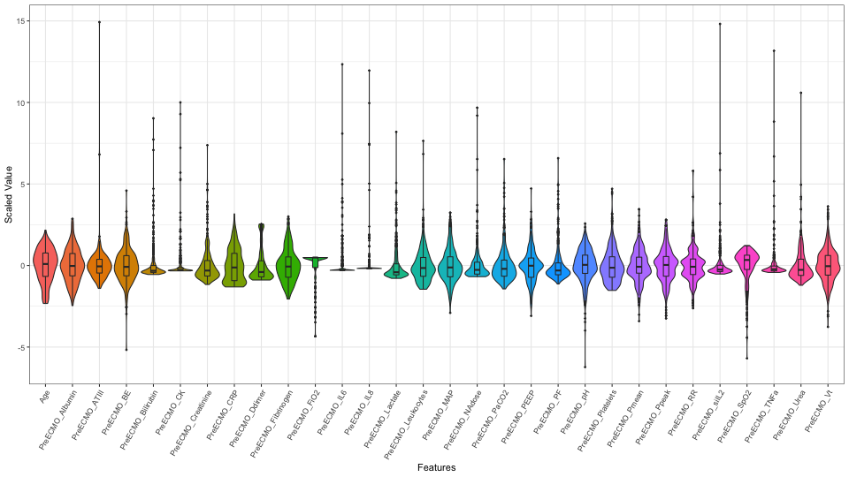

---
title: "Multiple Imputation and Cross-Validation for Classification of Survival Prediction"

thesis: MASTER THESIS
major: Biostatistics
output:
  pdf_document:
    citation_package: natbib
    number_sections: yes
    fig_caption: yes
#    toc: true
    toc_depth: 2
  latex_engine: xelatex
  includes:
    before_body: before_body.tex

tables: true
mainfont: Calibri Light
fontsize: 12pt
geometry: "left=3cm,right=3cm,top=3cm,bottom=3cm"

# bibliography: MasterOfCellTypes.bib
# fontsize: 11
# csl: chicago-author-date.csl
# csl: nature.csl


header-includes: 
  \usepackage[bottom]{footmisc}
  \usepackage{float}
  \floatplacement{figure}{H}
  \usepackage{color}
  \usepackage[table]{xcolor}
  \usepackage{caption}
  \captionsetup[table]{skip=5pt, font=footnotesize}
  \usepackage[font=footnotesize]{caption}
---

```{r setup, include=FALSE, echo = FALSE, eval = TRUE}
knitr::opts_chunk$set(echo = TRUE, eval = TRUE, warning = FALSE, message = FALSE, comment = NA, fig.pos='H', cache=TRUE)
options()
```

```{r libraries, echo = FALSE, eval = TRUE, warning = FALSE, message = FALSE}
library(ggplot2)
library(dplyr)
library(skimr)
library(tidyr)
library(kableExtra)
library(gridExtra)
library(xtable)
library(knitr)
library(glmnet)
```


\vspace{2cm}
\begin{center}
Robert Edwards 

\vspace{0.125cm}
(2416963E)


\vspace{1cm}
MASTER THESIS 

\vspace{0.125cm}
Biostatistics

\vspace{10cm}
  \includegraphics[height = 1.5cm]{images/GUlogo.png}
\end{center}


\newpage 
\tableofcontents
\listoffigures
\listoftables
\newpage

\newpage
#Introduction

## Aim of the Thesis

## The Clinical Study

## Study Population & Data Description

## The Statistical Challenege


```{r missing-data, echo = FALSE, eval = TRUE, fig.pos="H", fig.align = 'center', out.width = '100%', fig.cap = "\\label{fig.ensemble-imputation}Visual representation of missing observations in the ARDS dataset."}
knitr::include_graphics("images/missing_data_visualization.png")
```


\newpage
#Methodology

##Basic Statistical Methods

###Logistic Regression

Logistic regression is a widely used approach in binary classification.  It is set up as a generalised linear model using a logit link that produces a probability. 

###Linear Discriminant Analysis

Linear Discriminant Analysis (LDA) is a widely used method classification method.  generlization of Fisher's Linear Discriminant **(Fisher 1936)**.  Ddiscriminant functions are created through a linear combination of the explanatory variables that characterize the classes.  

$$
\text{Pr}(C_g \ | \ \mathbf{x}) = \frac{\pi_g \text{exp}(-\frac{1}{2} d_g (\mathbf{x}))}{\sum^2_{i=1}\pi_g \text{exp}(-\frac{1}{2} d_i (\mathbf{x}))} ~~~~ g = 1,2
$$

Assumptions of LDA:

+ Explanatory variables are assumed to be normally distributed
+ Homoskedasticity, equal class covariances
+ No multicollinearity
+ Independent observations


Drawbacks of LDA: 

+ Can only utilize continuous explanatory variables
+ Cannot handle missing data


###Quadratic Discriminant Analysis

**(Cover 1965)** 

Quadratic Discriminant Analysis (QDA) is an even more generlized form of discriminant analysis than LDA.  QDA has the same assumptions as LDA with the exception that the covariance of each class is not assumed to be identical.  

Assumptions of QDA:

+ Explanatory variables are assumed to be normally distributed
+ No multicollinearity
+ Independent observations

Drawbacks of QDA: 

+ Can only utilize continuous explanatory variables
+ Cannot handle missing data


###K-Nearest Neighbors

$K$-Nearest Neighbors (KNN) is a commonly used non-parametric classification method.  

###Random Forests


##Missing Data


##Multiple Imputation


##Validation & Cross-validation


##Accuracy Metrics

These are the default metrics used to evaluate algorithms on binary and multi-class classification datasets in caret.

###Accuracy

Accuracy is the percentage of correctly classifies instances out of all instances. It is more useful on a binary classification than multi-class classification problems because it can be less clear exactly how the accuracy breaks down across those classes (e.g. you need to go deeper with a confusion matrix). Learn more about Accuracy here.

Don’t use accuracy (or error rate) to evaluate your classifier! There are two significant problems with it. Accuracy applies a naive 0.50 threshold to decide between classes, and this is usually wrong when the classes are imbalanced. Second, classification accuracy is based on a simple count of the errors, and you should know more than this. You should know which classes are being confused and where (top end of scores, bottom end, throughout?)

```{r confusion-matrix, echo = FALSE, eval = TRUE, warning = FALSE, message = FALSE, out.width = '100%', fig.align="center", fig.pos="H"}

xtab <- matrix(c("a", "b", "c", "d"), nrow = 2, byrow = TRUE)
colnames(xtab) <- c("Y", "N")
rownames(xtab) <- c("Y", "N")

xtab %>%
  kable(format = "latex", 
        align = c("l", rep("c", 2)), 
        booktabs = TRUE,
        col.names = c("Y", "N"), 
        caption = '\\label{tab:confusion-matrix} Confusion matrix for two classes.') %>%
    kable_styling(font_size = 12, 
                  latex_options = c("hold_position", "striped")) %>%
#  column_spec(1, width = "4em") %>%
  row_spec(0, align = "c")# %>%
#  column_spec(0, bold = T) %>%
#  collapse_rows(columns = 1, valign = "middle") %>%
#  add_header_above(c(" " = 1, "Observed" = 2), bold = TRUE)
```

```{r xtab, echo = FALSE, eval = FALSE}
xtab %>%
  kable(booktabs = TRUE, 
        align = c("|c", "l"),
        format = "latex",
        caption = '\\label{tab:confusion-matrix} Confusion matrix for two classes.') %>%
    kable_styling(font_size = 10, 
                  latex_options = c("hold_position", "striped")) 
        
```


$$
\text{accuracy} = \frac{a+d}{a+b+c+d}
$$

###ROC


###Cohen's Kappa

Kappa or Cohen’s Kappa is like classification accuracy, except that it is normalized at the baseline of random chance on your dataset. It is a more useful measure to use on problems that have an imbalance in the classes 
On the ARDS datasets, for example, if `ECMO_Survival` is predicted to be "Y" for all cases, then the accuracy is 75% but the prediction is no better than the baseline likelihood of the class percentages.  

Let $p_o$ be the accuracy, the relative observed agreement between observed and predicted classes and let $p_e$ be the probability of chance agreement based on the class probabilities.  Cohen's Kappa is defined as:

$$
\kappa = \frac{p_o - p_e}{1 - p_e}
$$
If all the observations are predicted correctly then $\kappa=1$.  **If the observations are predicted no better than expected by the class probabilities, $p_e$ then $\kappa=0$.  If all the observations are predicted incorrectly, then $\kappa=-1$.**  A positive $\kappa$ indicates that the model predicts better than would be expected by chance whereas a negative $\kappa$ indicates that the model predicts worse than would be expected by chance.  

$$
p_o = \frac{a+d}{a+b+c+d}
$$

For class $k$, number of items $N$ and $n_{ki}$, the number of times $i$ is predicted as class $k$:

$$
p_e = \sum_k \hat{p}_{k1} \hat{p}_{k2} = \sum_k \frac{n_{k1}}{N}\frac{n_{k2}} {N} = \frac{1}{N^2} \sum_k n_{k1}n_{k2}
$$

###Brier Score


###F1 Score


\newpage
#Statistical Methods for the Analysis

**Describe the methods step-by-step for the analysis**

##Complete Case Analysis


##Mean Imputation


##Multiple Imputation


###Joint-Model

###Fully Conditional  Specification

###Predictive Mean Matching

Predictive Mean Matching (PMM) is a semi-parametric imputation approach. It is similar to the regression method except that for each missing value, it fills in a value randomly from among the a observed donor values from an observation whose regression-predicted values are closest to the regression-predicted value for the missing value from the simulated regression model (Heitjan and Little 1991; Schenker and Taylor 1996).
The PMM method ensures that imputed values are plausible; it might be more appropriate than the regression method (which assumes a joint multivariate normal distribution) if the normality assumption is violated (Horton and Lipsitz 2001, p. 246).

**Ensemble Multiple Imputation**  
The steps in the ensemble approach for multiply imputed data in k-fold cross-validation are as follows:

1. Randomly partition the training data into $k$ folds
2. Define the $k^{th}$ as the test set and the remaining $k-1$ folds as the training set
3. Impute the training set $m$ times, with the response variable `ECMO_Survival` included, to create $m$ imputed training sets
4. Concatenate the $m$ imputed training sets into one extended training set
5. A model is fitted to the extended training set
6. The test set is concatenated with the extended training set
7. Impute the combined test and extended training set, with the response variable `ECMO_Survival` excluded, to create $m$ imputed combined test and extended training sets
8. Extract the $m$ test sets
9. Make $m$ predictions on the $m$ imputed test sets
10. Take the majority vote of the $m$ predictions as the prediction for the fitted model
11. Validate the prediction against the test set by calculating Cohen's Kappa (note there are no missing values for the response variable in the data)
12. Repeat steps 2-11 $k$ times and validate the fitted model on each training set against the test set for each fold
13. Average the $k$ calculated Cohen's Kappas as the estimated in-sample accuracy metric


```{r ensemble-imputation, echo = FALSE, eval = TRUE, fig.pos="H", fig.align = 'center', out.width = '100%', fig.cap = "\\label{fig.ensemble-imputation}Outline of the algorithm used to pool predictions from multiple imputation.  (a) Step 1. (b) Step 2. (c) Step 3. (d) Step 4.  (e) Step 5.  (f) Step 6."}
knitr::include_graphics("images/ensemble-imputation.png")
```


\newpage
#Results

```{r cv-kappa, echo = FALSE, eval = TRUE, warning = FALSE, message = FALSE, out.width = '100%', fig.align="center", fig.pos="H"}
load("../project/_trained-models/trained-models-complete-case.RData")
kappa_cc <- as.data.frame(cbind(kappa_logit, kappa_lda, kappa_qda, max(kappa_knn$kappa), max(kappa_rf$kappa)) )

load("../project/_trained-models/trained-models-mean.RData")
kappa_mean <- as.data.frame(cbind(kappa_logit, kappa_lda, kappa_qda, max(kappa_knn$kappa), max(kappa_rf$kappa)) )

load("../project/_trained-models/trained-models-pmm99.RData")
kappa_pmm <- as.data.frame(cbind(kappa_logit, kappa_lda, kappa_qda, max(kappa_knn$kappa), max(kappa_rf$kappa)) )

kappa_table <- rbind(kappa_cc, kappa_mean, kappa_pmm)
kappa_table <- round(kappa_table, 3)
colnames(kappa_table) <- c("Logit", "LDA", "QDA", "KNN", "RF")
rownames(kappa_table) <- c("Complete Case", "Mean", "PMM")

kappa_table %>%
  kable(#col.names = c("Variables", "Test", "df", "p.value"), 
        caption = '\\label{tab:cv-kappa} Averaged Cohen\'s Kappa for each model fitted in cross-validation.  The number of neighbors, K, for K-Nearest Neighbors is 15.  The number of randomly selected variables at a split in Random Forests is 1.',
        booktabs = TRUE, 
        format = "latex") %>%
  kable_styling(font_size = 10, 
                latex_options = "hold_position")
```

\newpage
#Discussion


\newpage
#Conclusion


\newpage
#Bibliography

\newpage
#Appendices

##Additional Material


```{r heatmap-standardized, echo = FALSE, eval = TRUE, fig.pos="H", fig.align = 'center', out.width = '100%', fig.cap = "\\label{fig.ensemble-imputation}Heatmap of standardized and transformed variables."}
knitr::include_graphics("images/heatmap_standardized.png")
```


```{r violin, echo = FALSE, eval = TRUE, fig.pos="H", fig.align = 'center', out.width = '100%', fig.cap = "\\label{fig.ensemble-imputation}Violin plot of standardized variables."}

```


```{r violin-yeojohnson, echo = FALSE, eval = TRUE, fig.pos="H", fig.align = 'center', out.width = '100%', fig.cap = "\\label{fig.ensemble-imputation}Violin plot of standardized and transformed variables."}

```


##R Code


